# Tools for Mechanistic Interpretability

## Transformerlens

Have a variety of tutorials and step by step explanations. Has a limited number of supported models. Some patching functions do not work if the model has different number of attention heads and kv heads.

## NNsight

Basically supports all the models that use transformers. Uses complicated data types, which makes it harder to debug programs.

## Pyvene

Has a limited number of supported models but can be easily expanded (by creating modelings_intervenable_MODEL.py and adding stuff to intervenable_modelcard.py). Easier to debug compared to nnsight.

# Translation-Heads

## Terms (and what it could mean to our case)

### Ablation

Deletes one activation and see the change in logits.

- Zero Ablation
- Mean Ablation
- Random Ablation: Replacing the activation with the same activation on a randomly chosen other data point

### Logit Difference

The difference between two possible next tokens.

It works even better if you can take the average logit difference with another prompt with the answers the other way round. Eg the average logit difference between Paris and Rome in “The Eiffel Tower is in” and between Rome and Paris in “The Colosseum is in”. This controls for things even better, as sometimes the model has memorised “Rome occurs more often than Paris”, and this averaging will cancel that out.

### Logit Lens

A technique where we take the residual stream after layer $k$ per-token loss. The key finding is that, often, the model has become confident in the correct next token before the final layer, and each layer incrementally improves and refines that confidence.

This is equivalent to zero ablating layers $k+1 … n_{layers}-1$.

### Activation Patching

It runs the model on input A, replaces (patches) an activation with that same activation on input B, and sees how much that shifts the answer from A to B.

A key detail is that we move a single activation from the clean run to the corrupted run. So if this changes the answer from incorrect to correct, we can be confident that the activation moved was important

Causal tracing is a type of activation patching.

### Path Patching

For a pair of components, we patch in the clean output of component 1, but only along paths that affect the input of component 2.

Direct Path Patching: A simpler variant where we only patch in the component of the input to component 2 that directly comes from component 1.

In the arena tutorials, it is fixing the receiver heads and making a table by changing the sender head one by one. In [Exploring Translation Mechanism of Large Language Models](https://arxiv.org/html/2502.11806v2#bib.bib40), it looks like they are fixing the receiver head as the final logits. Also, they are injecting the activation from corrupted input to the clean stream.

### Attribution Patching

Use gradients to take a linear approximation to activation patching. By computing the gradient with respect to each activation, we can estimate the change in logits.

## Difference in Attention Head Pattern

Input - An English sentence followed by a sentence in another language. Syntax is as follows.

> EN: This is the largest temple that I've seen. FR: C'est le plus grand temple que j'ai jamais vu.

Used pretrained Qwen2.5-3B and Gemma2-2B.

Computed the mean of the diagonal elements that correspond to the attention from the sentence in another language to the sentence in English.

For the details, please refer to the source code.

The result is as follows. Nonrand means the sentences are translation and rand means it is just a random sentence with similar lengths.

### Qwen2.5-3B

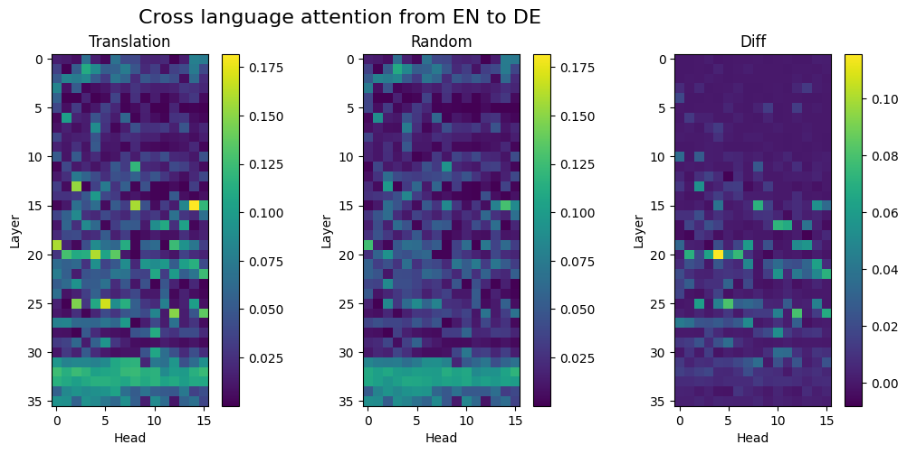

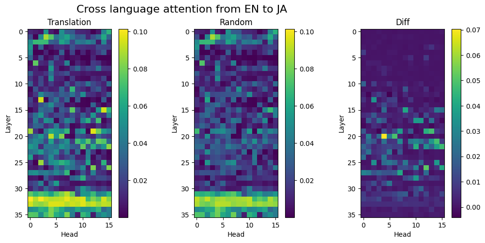

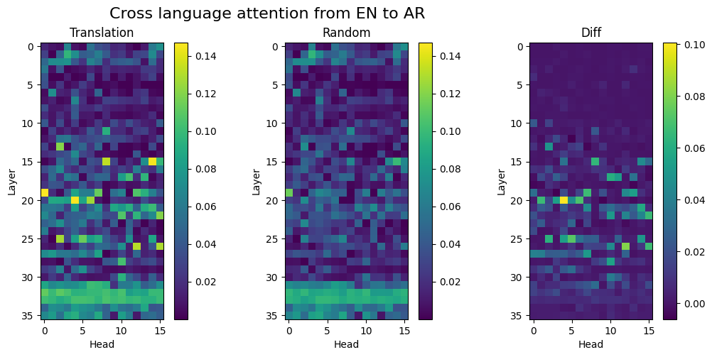

The following is the possible translation heads identified based on the difference in the attention values. I used 0.075 for the threshold except Japanese, whose threshold is 0.05.

FR: ['20.1', '20.4', '20.6', '25.5', '26.12']
DE: ['20.4', '20.6', '25.5', '26.12']
JA: ['20.4', '26.12']
AR: ['20.4', '26.12']
ES: ['15.8', '20.1', '20.4', '20.6', '22.15', '25.5', '26.12']

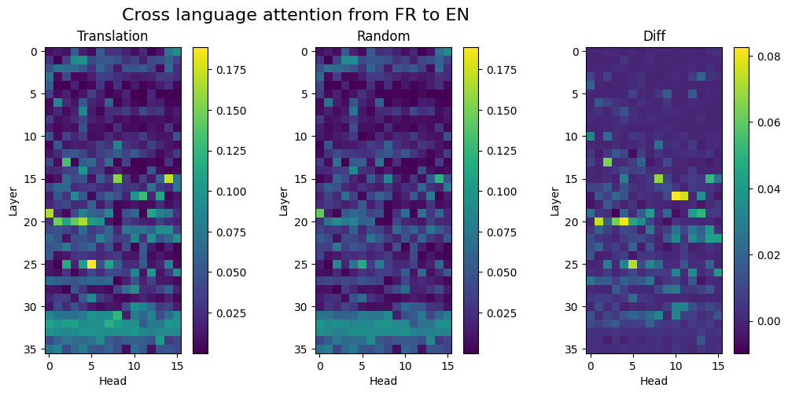

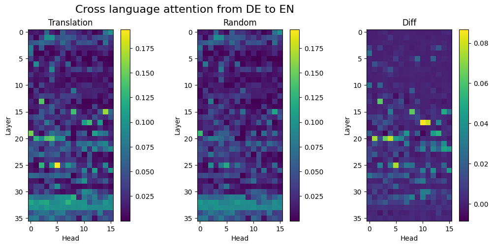

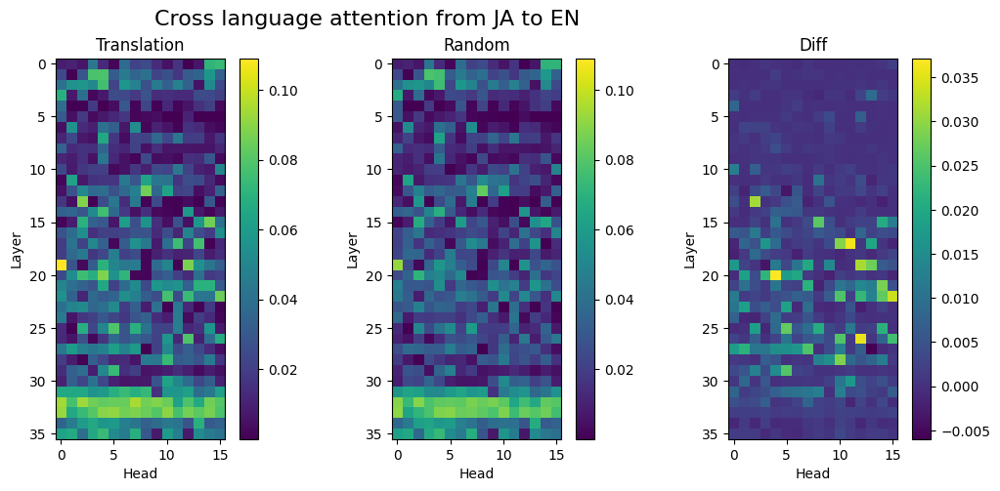

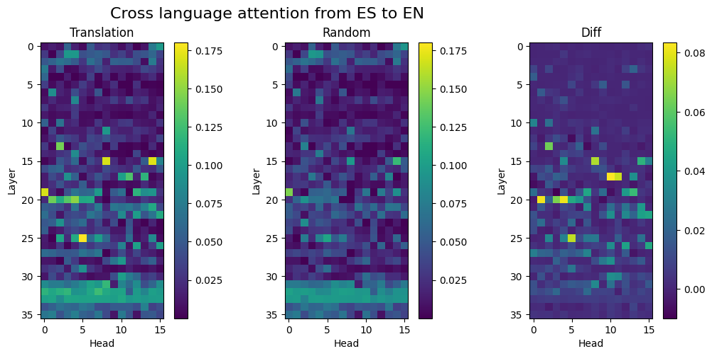

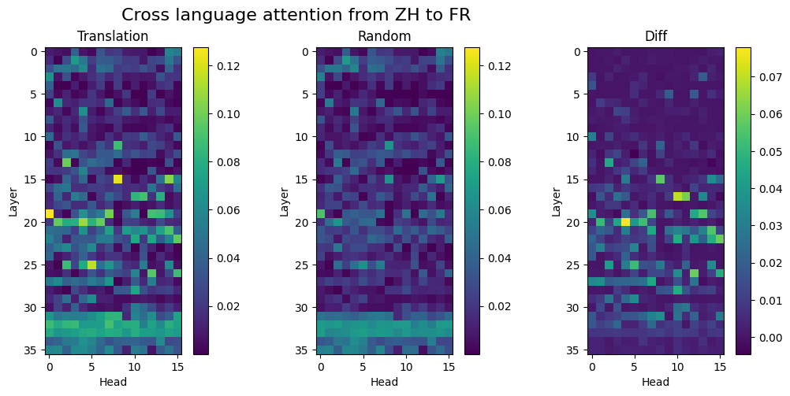

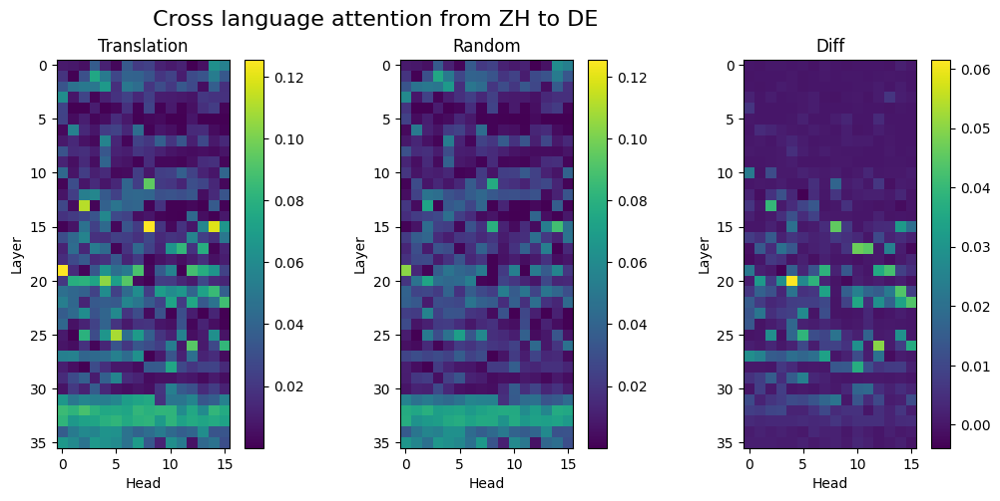

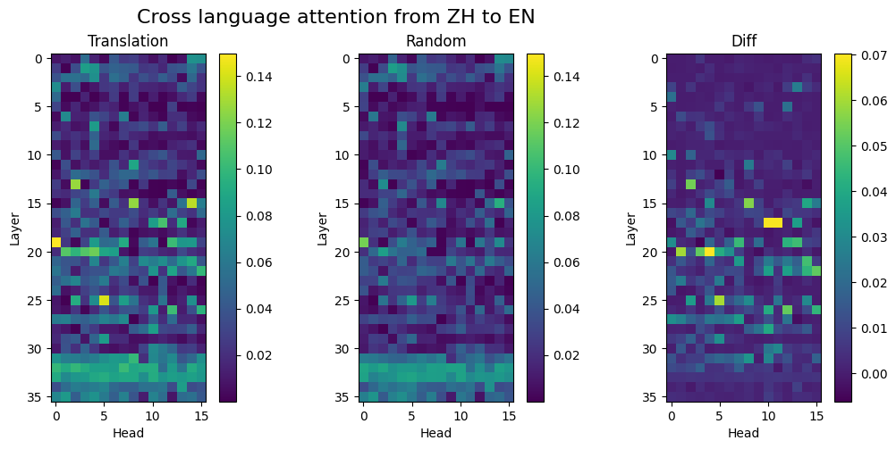

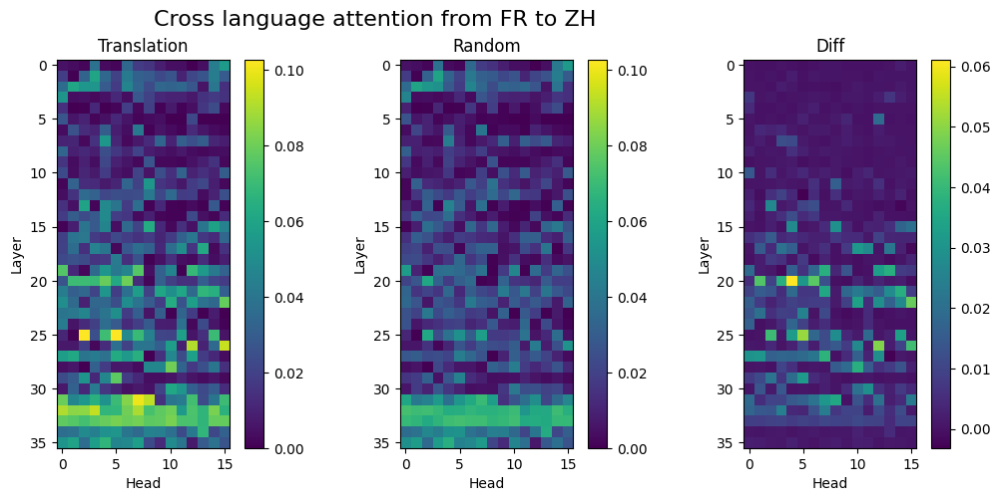

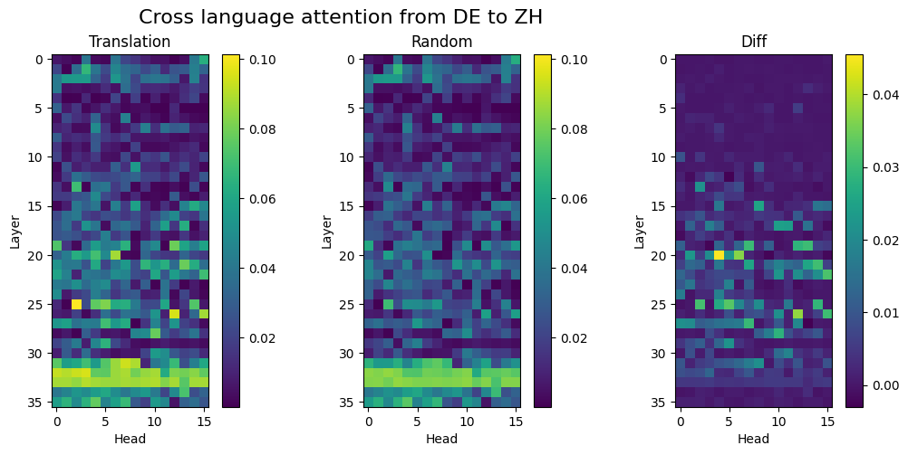

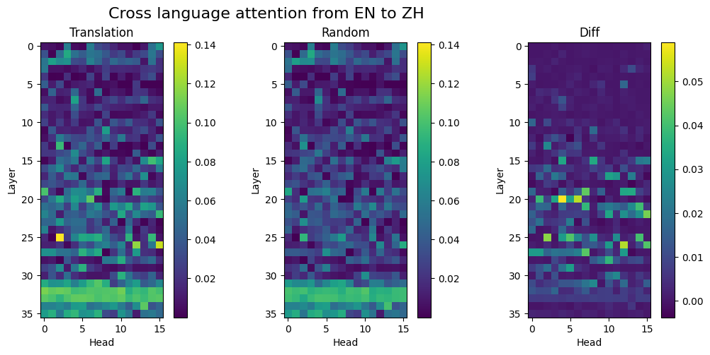

### Gemma2-2B

[French Gemma]
*English-French translation in Gemma*

[German Gemma]
*English-German translation in Gemma*

[Japanese Gemma]
*English-Japanese translation in Gemma*

[Arabic Gemma]
*English-Arabic translation in Gemma*

[Spanish Gemma]
*English-Spanish translation in Gemma*

The following is the possible translation heads identified based on the difference in the attention values. I used 0.04 for the threshold except Japanese, whose threshold is 0.03.

FR: ['6.2', '8.1', '10.4', '15.0']
DE: ['5.2', '6.1', '6.2', '8.1', '8.6', '10.4', '10.5', '15.0']
JA: ['6.2', '8.1', '8.6', '10.4', '12.3', '15.0', '16.4', '16.7']
AR: ['6.2', '8.1', '8.6', '10.4', '10.5', '15.0']
ES: ['6.2', '8.1', '10.5', '15.0']

## Ablation

Failed Attempt

Tried to do ablation by injecting corrupted inputs to the correct stream. Took the diffrence in logits of the first French word.

The corrupted inputs that I tried are as follows.

- mean values over the English sentences
- max values over the English sentences
- min values over the English sentences
- zero ablation

Injecting the values from English sentences does not make a good comparison as too much things are changed at the same time.

The sentence I tried is "EN: I'm onto him now. FR: Je le tiens."

In all the cases, it turned out that the heads identified by the attention pattern does not play a big role but instead, the first layer and L3H0, L7H4 plays a big role. This possibly implies that there is a translation head activated when the original translation heads are deactivated. However, this experiment is not rigorous enough to conclude anything. As for why the first layer is important, it is likely that the first layer contributes to which information is read.

