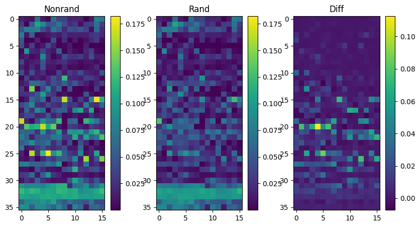
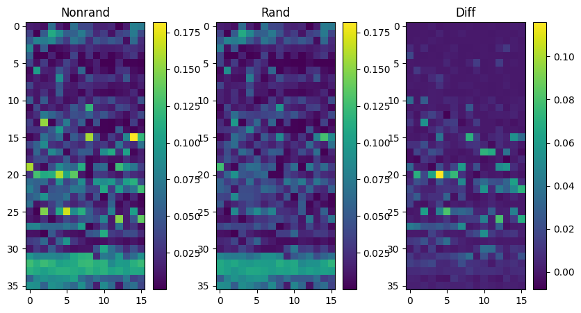
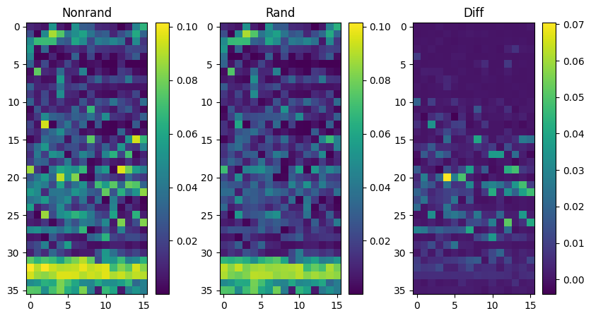
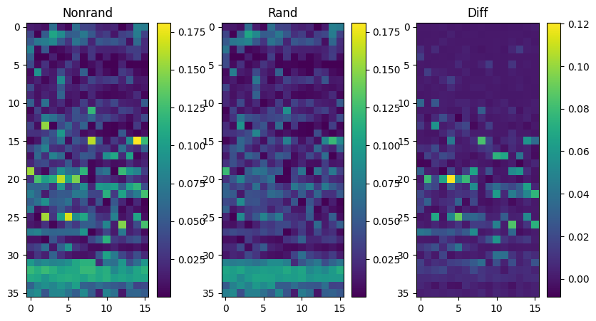
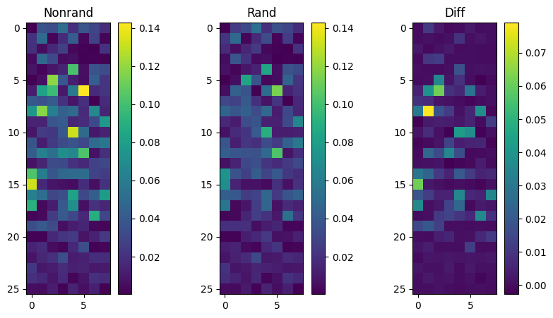
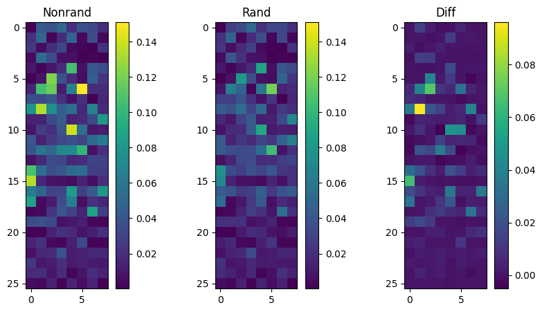
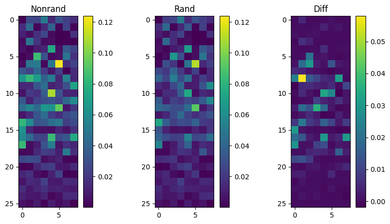
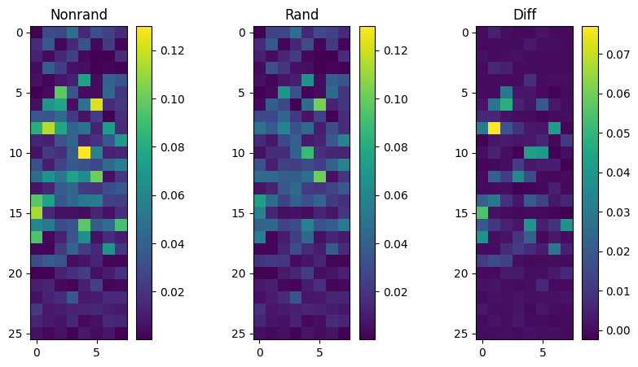

# Translation-Heads

## Difference in Attention Head Pattern

Input - An English sentence followed by a sentence in another language. Syntax is as follows.

> EN: This is the largest temple that I've seen. FR: C'est le plus grand temple que j'ai jamais vu.

Used pretrained Qwen2.5-3B and Gemma2-2B.

Computed the mean of the diagonal elements that correspond to the attention from the sentence in another language to the sentence in English.

For the details, please refer to the source code.

The result is as follows. Nonrand means the sentences are translation and rand means it is just a random sentence with similar lengths.

*English-French translation in Qwen*

*English-German translation in Qwen*

*English-Japanese translation in Qwen*

*English-Arabic translation in Qwen*

*English-Spanish translation in Qwen*

The following is the possible translation heads identified based on the difference in the attention values. I used 0.075 for the threshold except Japanese, whose threshold is 0.05.

FR: ['20.1', '20.4', '20.6', '25.5', '26.12']
DE: ['20.4', '20.6', '25.5', '26.12']
JA: ['20.4', '26.12']
AR: ['20.4', '26.12']
ES: ['15.8', '20.1', '20.4', '20.6', '22.15', '25.5', '26.12']

*English-French translation in Gemma*

*English-German translation in Gemma*

*English-Japanese translation in Gemma*

*English-Arabic translation in Gemma*

*English-Spanish translation in Gemma*

The following is the possible translation heads identified based on the difference in the attention values. I used 0.04 for the threshold except Japanese, whose threshold is 0.03.

FR: ['6.2', '8.1', '10.4', '15.0']
DE: ['5.2', '6.1', '6.2', '8.1', '8.6', '10.4', '10.5', '15.0']
JA: ['6.2', '8.1', '8.6', '10.4', '12.3', '15.0', '16.4', '16.7']
AR: ['6.2', '8.1', '8.6', '10.4', '10.5', '15.0']
ES: ['6.2', '8.1', '10.5', '15.0']
