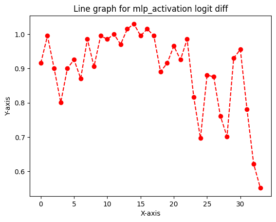

# Tools for Mechanistic Interpretability

## Transformerlens

Have a variety of tutorials and step by step explanations. Has a limited number of supported models. Some patching functions do not work if the model has different number of attention heads and kv heads.

## NNsight

Basically supports all the models that use transformers. Uses complicated data types, which makes it harder to debug programs.

## Pyvene

Has a limited number of supported models but can be easily expanded (by creating modelings_intervenable_MODEL.py and adding stuff to intervenable_modelcard.py). Easier to debug compared to nnsight.

# Translation-Heads

## Terms (and what it could mean to our case)

### Ablation

Deletes one activation and see the change in logits.

- Zero Ablation
- Mean Ablation
- Random Ablation: Replacing the activation with the same activation on a randomly chosen other data point

### Logit Difference

The difference between two possible next tokens.

It works even better if you can take the average logit difference with another prompt with the answers the other way round. Eg the average logit difference between Paris and Rome in “The Eiffel Tower is in” and between Rome and Paris in “The Colosseum is in”. This controls for things even better, as sometimes the model has memorised “Rome occurs more often than Paris”, and this averaging will cancel that out.

### Logit Lens

A technique where we take the residual stream after layer $k$ per-token loss. The key finding is that, often, the model has become confident in the correct next token before the final layer, and each layer incrementally improves and refines that confidence.

This is equivalent to zero ablating layers $k+1 … n_{layers}-1$.

### Activation Patching

It runs the model on input A, replaces (patches) an activation with that same activation on input B, and sees how much that shifts the answer from A to B.

A key detail is that we move a single activation from the clean run to the corrupted run. So if this changes the answer from incorrect to correct, we can be confident that the activation moved was important

Causal tracing is a type of activation patching.


### Path Patching

For a pair of components, we patch in the clean output of component 1, but only along paths that affect the input of component 2.

Direct Path Patching: A simpler variant where we only patch in the component of the input to component 2 that directly comes from component 1.


In the arena tutorials, it is fixing the receiver heads and making a table by changing the sender head one by one. In [Exploring Translation Mechanism of Large Language Models](https://arxiv.org/html/2502.11806v2#bib.bib40), it looks like they are fixing the receiver head as the final logits. Also, they are injecting the activation from corrupted input to the clean stream.

### Attribution Patching

Use gradients to take a linear approximation to activation patching. By computing the gradient with respect to each activation, we can estimate the change in logits.

## Difference in Attention Head Pattern

Input - An English sentence followed by a sentence in another language. Syntax is as follows.

> EN: This is the largest temple that I've seen. FR: C'est le plus grand temple que j'ai jamais vu.

Used pretrained Qwen2.5-3B and Gemma2-2B.

Computed the mean of the diagonal elements that correspond to the attention from the sentence in another language to the sentence in English.

For the details, please refer to the source code.

The result is as follows. Nonrand means the sentences are translation and rand means it is just a random sentence with similar lengths.

### Qwen2.5-3B


The following is the possible translation heads identified based on the difference in the attention values. I used 0.075 for the threshold except Japanese, whose threshold is 0.05.

FR: ['20.1', '20.4', '20.6', '25.5', '26.12']
DE: ['20.4', '20.6', '25.5', '26.12']
JA: ['20.4', '26.12']
AR: ['20.4', '26.12']
ES: ['15.8', '20.1', '20.4', '20.6', '22.15', '25.5', '26.12']


### Gemma2-2B

[French Gemma]
*English-French translation in Gemma*

[German Gemma]
*English-German translation in Gemma*

[Japanese Gemma]
*English-Japanese translation in Gemma*

[Arabic Gemma]
*English-Arabic translation in Gemma*

[Spanish Gemma]
*English-Spanish translation in Gemma*

The following is the possible translation heads identified based on the difference in the attention values. I used 0.04 for the threshold except Japanese, whose threshold is 0.03.

FR: ['6.2', '8.1', '10.4', '15.0']
DE: ['5.2', '6.1', '6.2', '8.1', '8.6', '10.4', '10.5', '15.0']
JA: ['6.2', '8.1', '8.6', '10.4', '12.3', '15.0', '16.4', '16.7']
AR: ['6.2', '8.1', '8.6', '10.4', '10.5', '15.0']
ES: ['6.2', '8.1', '10.5', '15.0']

## Ablation

<details>

<summary>Failed Attempt</summary>

Tried to do ablation by injecting corrupted inputs to the correct stream. Took the diffrence in logits of the first French word.

The corrupted inputs that I tried are as follows.

- mean values over the English sentences
- max values over the English sentences
- min values over the English sentences
- zero ablation

Injecting the values from English sentences does not make a good comparison as too much things are changed at the same time.

The sentence I tried is "EN: I'm onto him now. FR: Je le tiens."

In all the cases, it turned out that the heads identified by the attention pattern does not play a big role but instead, the first layer and L3H0, L7H4 plays a big role. This possibly implies that there is a translation head activated when the original translation heads are deactivated. However, this experiment is not rigorous enough to conclude anything. As for why the first layer is important, it is likely that the first layer contributes to which information is read.

</details>


## Experiments

### Hypothesis

As LLMs can understand the context apparently, it is natural to consider that it has thinking ability. Then, a question of whether it has multiple thinking space or one thinking space arises.

In a translation task, the goal is to express a sentence in one language in another language so that it is grammatically and contextually correct. Then, we can divide tha task of translation into 2 smaller tasks: understanding the context ("contextually correct" part), converting the concepts understood in a grammatically correct way ("grammatically correct" part).

The two related literatures "Exploring Translation Mechanism of Large Language Models" and "Tracing the thoughts of a large language model" can be understood in the context of our experiment as follows. The former paper argues that LLMs use English-centric latent space representation. This means that the specific thinking space they use to understand the concept is similar to the latent representation in English. The latter blog argues that Claude uses a language agnostic thinking space. In other words, it states that there is a unique thinking space. Therefore, the two papers do not contradict each other (in my opinion).

Three things we can consider

1. Tricky part about the two smaller tasks mentioned is that LLMs also have to understand which language to use when understanding the context in addition to the meanings of the sentences. Therefore, we would like to figure out how the LLMs decide which language to use for the output.

2. Assuming that there is a language agnostic concept space, how does the model convert them to the human language. For example, if there is a concept in one language and the model wants to convert it to another language, where that concept does not exist in the language, how does the model behave?

3. The two related literature mentioned aboce both suggests the existence of language agnostic thinking space. How can we verify it?

What we are interested in is to see if we can separate the two tasks and if LLMs use a specific thinking space when understanding the context.

One hypothesis that is worth considering is that LLMs have language agnostic thinking space and tailors the output by changing the language of the desired output.

Alternatives are as follows.

 - LLMs think in one language (most likely English) and just translate the output.

 - LLMs have thinking space corresponding to each language.

### Logit Lens Experiments

I looked at the logit lens in the translation from Japanese to Korean in Qwen and Gemma.

The sentence used means "This is not the biggest temple that I have seen."

"日本語: これは私が見た中で最も大きい寺ではない。한국어: 이것은 내가 본 가장 큰 절이 아니다."

Qwen3-4b


Qwen3-32b


Gemma3-4b


Gemma3-27b


### What could be induced from the logitlens experiment

Smaller models rely a lot more on the centric language they are trained on. They translate the concept in the last few layers. Therefore, it should be possible to change the output language just by activating some head in the last few layers.

In the larger models, it depends on the model. Qwen3-32b shows similar tendency to the smaller models but Gemma3-27b is pretty fixed about the answer from an earlier layers.

If we can find such head, then we might be able to "force" the models to think in certain languages in the middle layers.


If "translation" signal and "repetition" signal is the same, then we should be able to do translation with just saying "repetition" and inserting the language information.

### Procedure for the experiments

Here is my hypothesis. LLMs understand the context in a language agnostic space (that has similar vocabulary as the language it is primarily trained on). The information on the context and the language will be processed through intermediate layers and what will be the output will be determined. After that, in the last few layers, it will be translated to the language of the output.

### Result

```
full_prompt = "日本語: これは私が見た中で最も大きい寺ではない。한국어: 이것은 내가 본 가장 큰 절이 아니다."
clean_prompt = "日本語: これは私が見た中で最も大きい寺ではない。한국어: 이것은 내가 본 가장"
corrupt_prompt = "日本語: これは私が見た中で最も大きい寺ではない。한국어: 이것은 내가 본最も"
```

Predictions

```
Predictions for clean prompt
_큰                   0.9609375
_크                   0.02001953125
_커                   0.0027008056640625
_거                   0.00238037109375
_                    0.002105712890625
_넓                   0.001129150390625
_규모                  0.0009918212890625
_높은                  0.00087738037109375
_작은                  0.000774383544921875
큰                    0.000682830810546875
Predictions for corrupt prompt
大きい                  0.76953125
大きな                  0.08642578125
_큰                   0.038330078125
큰                    0.0169677734375
大き                   0.010986328125
巨大                   0.008544921875
寺                    0.005889892578125
大                    0.00518798828125
_大きい                 0.0026092529296875
大きく                  0.002166748046875
```

Denoising Experiments


Noising Experiments


```
full_prompt = "English: The teacher teaches English. 中文: 老师教英语。"
clean_prompt = "English: The teacher teaches English. 中文: 老师教"
corrupt_prompt = "English: The teacher teaches English. 中文: 老师 teaches"
```

Predictions

```
Predictions for clean prompt
英语                   0.6796875
英文                   0.171875
中文                   0.07177734375
汉语                   0.0206298828125
语文                   0.0206298828125
英語                   0.00191497802734375
国                    0.00191497802734375
中国                   0.00140380859375
课                    0.001312255859375
的是                   0.0012359619140625
Predictions for corrupt prompt
_English             0.70703125
_中                   0.095703125
_                    0.08447265625
_Chinese             0.024169921875
_english             0.01141357421875
_the                 0.01007080078125
.                    0.006500244140625
_in                  0.005401611328125
英语                   0.00421142578125
_(                   0.00347900390625
```

Denoising Experiments


Noising Experiments


```
full_prompt = "Español: El presidente visita la ciudad con su esposa cada año. Français: Le président visite la ville avec sa femme chaque année."
clean_prompt = "Español: El presidente visita la ciudad con su esposa cada año. Français: Le président visite la ville"
corrupt_prompt = "Español: El presidente visita la ciudad con su esposa cada año. Français: Le président visite la ciudad"
```

Predictions

```
Predictions for clean prompt
_avec                0.8359375
_chaque              0.099609375
_tous                0.022216796875
_et                  0.00927734375
_à                   0.0059814453125
_de                  0.0038604736328125
_en                  0.0038604736328125
,                    0.0034027099609375
_une                 0.0008087158203125
_toutes              0.0008087158203125
Predictions for corrupt prompt
_con                 0.39453125
_avec                0.34765625
_chaque              0.1650390625
_tous                0.01531982421875
_todos               0.0076904296875
_cada                0.0076904296875
_y                   0.006805419921875
_junto               0.006378173828125
_de                  0.005645751953125
_et                  0.003631591796875
```

Denoising Experiments


Noising Experiments


```
full_prompt = "English: The teacher reads the book with the students every morning. Deutsch: Der Lehrer liest das Buch mit den Schülern jeden Morgen."
clean_prompt = "English: The teacher reads the book with the students every morning. Deutsch: Der Lehrer liest das Buch mit den"
corrupt_prompt = "English: The teacher reads the book with the students every morning. Deutsch: Der Lehrer liest das Buch mit the"
```

Predictions

```
Predictions for clean prompt
_Sch                 0.83203125
_Kindern             0.068359375
_Schüler             0.04150390625
_Studenten           0.0322265625
_Stud                0.0081787109375
_Schu                0.0020599365234375
_Lern                0.00160980224609375
_Le                  0.00091552734375
_sch                 0.00067138671875
_Student             0.000629425048828125
Predictions for corrupt prompt
_students            0.421875
_Students            0.10693359375
_Sch                 0.09423828125
_Studenten           0.0732421875
_student             0.05712890625
_children            0.041748046875
_Schüler             0.0286865234375
_Student             0.025390625
_kids                0.015380859375
_Kindern             0.015380859375
```

Denoising Experiments


Noising Experiments





