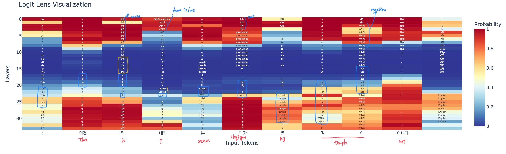
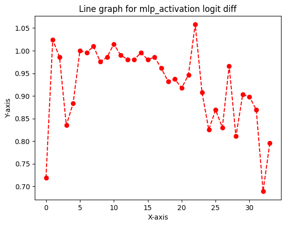

# Tools for Mechanistic Interpretability

## Transformerlens

Have a variety of tutorials and step by step explanations. Has a limited number of supported models. Some patching functions do not work if the model has different number of attention heads and kv heads.

## NNsight

Basically supports all the models that use transformers. Uses complicated data types, which makes it harder to debug programs.

## Pyvene

Has a limited number of supported models but can be easily expanded (by creating modelings_intervenable_MODEL.py and adding stuff to intervenable_modelcard.py). Easier to debug compared to nnsight.

# Translation-Heads

## Terms (and what it could mean to our case)

### Ablation

Deletes one activation and see the change in logits.

- Zero Ablation
- Mean Ablation
- Random Ablation: Replacing the activation with the same activation on a randomly chosen other data point

### Logit Difference

The difference between two possible next tokens.

It works even better if you can take the average logit difference with another prompt with the answers the other way round. Eg the average logit difference between Paris and Rome in “The Eiffel Tower is in” and between Rome and Paris in “The Colosseum is in”. This controls for things even better, as sometimes the model has memorised “Rome occurs more often than Paris”, and this averaging will cancel that out.

### Logit Lens

A technique where we take the residual stream after layer $k$ per-token loss. The key finding is that, often, the model has become confident in the correct next token before the final layer, and each layer incrementally improves and refines that confidence.

This is equivalent to zero ablating layers $k+1 … n_{layers}-1$.

### Activation Patching

It runs the model on input A, replaces (patches) an activation with that same activation on input B, and sees how much that shifts the answer from A to B.

A key detail is that we move a single activation from the clean run to the corrupted run. So if this changes the answer from incorrect to correct, we can be confident that the activation moved was important

Causal tracing is a type of activation patching.


### Path Patching

For a pair of components, we patch in the clean output of component 1, but only along paths that affect the input of component 2.

Direct Path Patching: A simpler variant where we only patch in the component of the input to component 2 that directly comes from component 1.


In the arena tutorials, it is fixing the receiver heads and making a table by changing the sender head one by one. In [Exploring Translation Mechanism of Large Language Models](https://arxiv.org/html/2502.11806v2#bib.bib40), it looks like they are fixing the receiver head as the final logits. Also, they are injecting the activation from corrupted input to the clean stream.

### Attribution Patching

Use gradients to take a linear approximation to activation patching. By computing the gradient with respect to each activation, we can estimate the change in logits.

## Difference in Attention Head Pattern

Input - An English sentence followed by a sentence in another language. Syntax is as follows.

> EN: This is the largest temple that I've seen. FR: C'est le plus grand temple que j'ai jamais vu.

Used pretrained Qwen2.5-3B and Gemma2-2B.

Computed the mean of the diagonal elements that correspond to the attention from the sentence in another language to the sentence in English.

For the details, please refer to the source code.

The result is as follows. Nonrand means the sentences are translation and rand means it is just a random sentence with similar lengths.

### Qwen2.5-3B


The following is the possible translation heads identified based on the difference in the attention values. I used 0.075 for the threshold except Japanese, whose threshold is 0.05.

FR: ['20.1', '20.4', '20.6', '25.5', '26.12']
DE: ['20.4', '20.6', '25.5', '26.12']
JA: ['20.4', '26.12']
AR: ['20.4', '26.12']
ES: ['15.8', '20.1', '20.4', '20.6', '22.15', '25.5', '26.12']


### Gemma2-2B

[French Gemma]
_English-French translation in Gemma_

[German Gemma]
_English-German translation in Gemma_

[Japanese Gemma]
_English-Japanese translation in Gemma_

[Arabic Gemma]
_English-Arabic translation in Gemma_

[Spanish Gemma]
_English-Spanish translation in Gemma_

The following is the possible translation heads identified based on the difference in the attention values. I used 0.04 for the threshold except Japanese, whose threshold is 0.03.

FR: ['6.2', '8.1', '10.4', '15.0']
DE: ['5.2', '6.1', '6.2', '8.1', '8.6', '10.4', '10.5', '15.0']
JA: ['6.2', '8.1', '8.6', '10.4', '12.3', '15.0', '16.4', '16.7']
AR: ['6.2', '8.1', '8.6', '10.4', '10.5', '15.0']
ES: ['6.2', '8.1', '10.5', '15.0']

## Ablation

<details>

<summary>Failed Attempt</summary>

Tried to do ablation by injecting corrupted inputs to the correct stream. Took the diffrence in logits of the first French word.

The corrupted inputs that I tried are as follows.

- mean values over the English sentences
- max values over the English sentences
- min values over the English sentences
- zero ablation

Injecting the values from English sentences does not make a good comparison as too much things are changed at the same time.

The sentence I tried is "EN: I'm onto him now. FR: Je le tiens."

In all the cases, it turned out that the heads identified by the attention pattern does not play a big role but instead, the first layer and L3H0, L7H4 plays a big role. This possibly implies that there is a translation head activated when the original translation heads are deactivated. However, this experiment is not rigorous enough to conclude anything. As for why the first layer is important, it is likely that the first layer contributes to which information is read.

</details>

## Experiments

### Hypothesis

As LLMs can understand the context apparently, it is natural to consider that it has thinking ability. Then, a question of whether it has multiple thinking space or one thinking space arises.

In a translation task, the goal is to express a sentence in one language in another language so that it is grammatically and contextually correct. Then, we can divide tha task of translation into 2 smaller tasks: understanding the context ("contextually correct" part), converting the concepts understood in a grammatically correct way ("grammatically correct" part).

The two related literatures "Exploring Translation Mechanism of Large Language Models" and "Tracing the thoughts of a large language model" can be understood in the context of our experiment as follows. The former paper argues that LLMs use English-centric latent space representation. This means that the specific thinking space they use to understand the concept is similar to the latent representation in English. The latter blog argues that Claude uses a language agnostic thinking space. In other words, it states that there is a unique thinking space. Therefore, the two papers do not contradict each other (in my opinion).

Three things we can consider

1. Tricky part about the two smaller tasks mentioned is that LLMs also have to understand which language to use when understanding the context in addition to the meanings of the sentences. Therefore, we would like to figure out how the LLMs decide which language to use for the output.

2. Assuming that there is a language agnostic concept space, how does the model convert them to the human language. For example, if there is a concept in one language and the model wants to convert it to another language, where that concept does not exist in the language, how does the model behave?

3. The two related literature mentioned aboce both suggests the existence of language agnostic thinking space. How can we verify it?

What we are interested in is to see if we can separate the two tasks and if LLMs use a specific thinking space when understanding the context.

One hypothesis that is worth considering is that LLMs have language agnostic thinking space and tailors the output by changing the language of the desired output.

Alternatives are as follows.

- LLMs think in one language (most likely English) and just translate the output.

- LLMs have thinking space corresponding to each language.

### Logit Lens Experiments

I looked at the logit lens in the translation from Japanese to Korean in Qwen and Gemma.

The sentence used means "This is not the biggest temple that I have seen."

"日本語: これは私が見た中で最も大きい寺ではない。한국어: 이것은 내가 본 가장 큰 절이 아니다."

Qwen3-4b


Qwen3-32b


Gemma3-4b



Gemma3-27b


### What could be induced from the logitlens experiment

Smaller models rely a lot more on the centric language they are trained on. They translate the concept in the last few layers. Therefore, it should be possible to change the output language just by activating some head in the last few layers.

In the larger models, it depends on the model. Qwen3-32b shows similar tendency to the smaller models but Gemma3-27b is pretty fixed about the answer from an earlier layers.

If we can find such head, then we might be able to "force" the models to think in certain languages in the middle layers.

If "translation" signal and "repetition" signal is the same, then we should be able to do translation with just saying "repetition" and inserting the language information.

### Procedure for the experiments

Here is my hypothesis. LLMs understand the context in a language agnostic space (that has similar vocabulary as the language it is primarily trained on). The information on the context and the language will be processed through intermediate layers and what will be the output will be determined. After that, in the last few layers, it will be translated to the language of the output.

### Result

```
full_prompt = "日本語: これは私が見た中で最も大きい寺ではない。한국어: 이것은 내가 본 가장 큰 절이 아니다."
clean_prompt = "日本語: これは私が見た中で最も大きい寺ではない。한국어: 이것은 내가 본 가장"
corrupt_prompt = "日本語: これは私が見た中で最も大きい寺ではない。한국어: 이것은 내가 본最も"
```

Predictions

```
Predictions for clean prompt
_큰                   0.9609375
_크                   0.02001953125
_커                   0.0027008056640625
_거                   0.00238037109375
_                    0.002105712890625
_넓                   0.001129150390625
_규모                  0.0009918212890625
_높은                  0.00087738037109375
_작은                  0.000774383544921875
큰                    0.000682830810546875
Predictions for corrupt prompt
大きい                  0.76953125
大きな                  0.08642578125
_큰                   0.038330078125
큰                    0.0169677734375
大き                   0.010986328125
巨大                   0.008544921875
寺                    0.005889892578125
大                    0.00518798828125
_大きい                 0.0026092529296875
大きく                  0.002166748046875
```

Denoising Experiments


Noising Experiments


```
full_prompt = "English: The teacher teaches English. 中文: 老师教英语。"
clean_prompt = "English: The teacher teaches English. 中文: 老师教"
corrupt_prompt = "English: The teacher teaches English. 中文: 老师 teaches"
```

Predictions

```
Predictions for clean prompt
英语                   0.6796875
英文                   0.171875
中文                   0.07177734375
汉语                   0.0206298828125
语文                   0.0206298828125
英語                   0.00191497802734375
国                    0.00191497802734375
中国                   0.00140380859375
课                    0.001312255859375
的是                   0.0012359619140625
Predictions for corrupt prompt
_English             0.70703125
_中                   0.095703125
_                    0.08447265625
_Chinese             0.024169921875
_english             0.01141357421875
_the                 0.01007080078125
.                    0.006500244140625
_in                  0.005401611328125
英语                   0.00421142578125
_(                   0.00347900390625
```

Denoising Experiments


Noising Experiments





```
full_prompt = "Español: El presidente visita la ciudad con su esposa cada año. Français: Le président visite la ville avec sa femme chaque année."
clean_prompt = "Español: El presidente visita la ciudad con su esposa cada año. Français: Le président visite la ville"
corrupt_prompt = "Español: El presidente visita la ciudad con su esposa cada año. Français: Le président visite la ciudad"
```

Predictions

```
Predictions for clean prompt
_avec                0.8359375
_chaque              0.099609375
_tous                0.022216796875
_et                  0.00927734375
_à                   0.0059814453125
_de                  0.0038604736328125
_en                  0.0038604736328125
,                    0.0034027099609375
_une                 0.0008087158203125
_toutes              0.0008087158203125
Predictions for corrupt prompt
_con                 0.39453125
_avec                0.34765625
_chaque              0.1650390625
_tous                0.01531982421875
_todos               0.0076904296875
_cada                0.0076904296875
_y                   0.006805419921875
_junto               0.006378173828125
_de                  0.005645751953125
_et                  0.003631591796875
```

Denoising Experiments


Noising Experiments


```
full_prompt = "English: The teacher reads the book with the students every morning. Deutsch: Der Lehrer liest das Buch mit den Schülern jeden Morgen."
clean_prompt = "English: The teacher reads the book with the students every morning. Deutsch: Der Lehrer liest das Buch mit den"
corrupt_prompt = "English: The teacher reads the book with the students every morning. Deutsch: Der Lehrer liest das Buch mit the"
```

Predictions

```
Predictions for clean prompt
_Sch                 0.83203125
_Kindern             0.068359375
_Schüler             0.04150390625
_Studenten           0.0322265625
_Stud                0.0081787109375
_Schu                0.0020599365234375
_Lern                0.00160980224609375
_Le                  0.00091552734375
_sch                 0.00067138671875
_Student             0.000629425048828125
Predictions for corrupt prompt
_students            0.421875
_Students            0.10693359375
_Sch                 0.09423828125
_Studenten           0.0732421875
_student             0.05712890625
_children            0.041748046875
_Schüler             0.0286865234375
_Student             0.025390625
_kids                0.015380859375
_Kindern             0.015380859375
```

Denoising Experiments


Noising Experiments


Patching with the third language (with similar grammatical structure)

```
full_prompt = "日本語: これは私が見た中で最も大きい寺ではない。Türkçe: Bu, gördüğüm yerler arasında en büyük tapınak değil."
clean_prompt = "日本語: これは私が見た中で最も大きい寺ではない。Türkçe: Bu, gördüğüm yerler arasında en"
corrupt_prompt = "日本語: これは私が見た中で最も大きい寺ではない。Türkçe: Bu, gördüğüm yerler arasında 가장"
```

Predictions

```
Predictions for clean prompt
_büyük               0.921875
_büy                 0.02783203125
_küçük               0.009033203125
_geniş               0.00701904296875
_büyü                0.006195068359375
_çok                 0.0037689208984375
_yüksek              0.0037689208984375
_kü                  0.0029296875
_kal                 0.002288818359375
_uzun                0.00177764892578125
Predictions for corrupt prompt
_큰                   0.365234375
_büyük               0.2353515625
_büyü                0.1044921875
_크                   0.0634765625
_büy                 0.0218505859375
大きい                  0.01507568359375
큰                    0.01251220703125
_                    0.007568359375
_작은                  0.005889892578125
_작                   0.005218505859375
```

Denoising Experiments


Noising Experiments


```
full_prompt = "Español: El presidente visita la ciudad con su esposa cada año. Français: Le président visite la ville avec sa femme chaque année."
clean_prompt = "Español: El presidente visita la ciudad con su esposa cada año. Français: Le président visite la ville avec sa femme chaque"
corrupt_prompt = "Español: El presidente visita la ciudad con su esposa cada año. Français: Le président visite la ville avec sa femme ogni"
```

Predictions

```
Predictions for clean prompt
_année               0.99609375
_an                  0.001922607421875
_années              0.00054931640625
_ans                 0.00020313262939453125
_fois                7.009506225585938e-05
.                    6.580352783203125e-05
_ann                 5.817413330078125e-05
_Ann                 4.8160552978515625e-05
_été                 4.8160552978515625e-05
\n\n                 3.528594970703125e-05
Predictions for corrupt prompt
_anno                0.9921875
_anni                0.00191497802734375
_ano                 0.000965118408203125
anno                 0.000583648681640625
_ann                 0.000377655029296875
_giorno              0.000377655029296875
_año                 0.0002765655517578125
_annet               0.000202178955078125
_year                0.00017833709716796875
_année               9.5367431640625e-05
```

Denoising Experiments


Noising Experiments


```
full_prompt = "Nederlands: De leraar leest het boek met de studenten elke ochtend. English: The teacher reads the book with the students every morning."
#full_prompt = "English: The teacher reads the book with the students every morning. Deutsch: Der Lehrer liest das Buch mit den Schülern jeden Morgen."
clean_prompt = "Nederlands: De leraar leest het boek met de studenten elke ochtend. English: The teacher reads the book with the students every"
corrupt_prompt = "Nederlands: De leraar leest het boek met de studenten elke ochtend. English: The teacher reads the book with the students jeden"
```

```
Predictions for clean prompt
_morning             0.98828125
_day                 0.00970458984375
<start_of_image>     0.0009002685546875
_evening             0.00022792816162109375
_mor                 0.00022792816162109375
_morn                0.00022792816162109375
\n\n                 0.00020122528076171875
_mom                 0.000156402587890625
\n                   0.00013828277587890625
morning              0.00013828277587890625
Predictions for corrupt prompt
_morgen              0.61328125
_morning             0.1005859375
_Morgen              0.0732421875
_dag                 0.039306640625
_Tag                 0.019775390625
_tag                 0.0174560546875
_day                 0.015380859375
_morg                0.00823974609375
.                    0.0034332275390625
_deň                 0.0028533935546875
```

Denoising Experiments


Noising Experiments


### Experiments breakdown

#### Language Patterns

I would categorize the similar languages as follows.

- SOV structure: Japanese, Korean, Turkish
- SVO structure
  - Romance language: French, Spanish, Italian
  - German language: Dutch, German, English
  - Similar to Chinese: Chinese, Vietnamese, Thai

I would also refer to high-resource language as English in Gemma. (Once I start experimenting in Qwen, I will also refer to Chinese as high-resource language.)

The experiments have the structure like this.

```
{Source language signifier}: complete sentence. {Target language signifier}: incomplete sentence
```

We will look at the logits or probability of the next token prediction. Keep in mind that language signifiers are the name of the language in their language (ex. English, 中文, Français, العربية, 日本語). Also, we will corrupt the last token of the second sentence so that we only have to patch at one last token.

There are two patterns of how to structure a sentence in terms of source and target languages.

- A A': the source and target languages are similar
- A B: the source and target languages are not similar

Further, there are other patterns as to how to corrupt the second sentence.

- A A'
  - A A' A: corrupt with the source language
  - A A' A'': corrupt with a similar third language
  - A A' B: corrupt with non-similar third language
- A B
  - A B A: corrupt with the source language
  - A B A': corrupt with a language similar to the source language
  - A B B': corrupt with a language similar to the target language
  - A B C: corrupt with a non-smilar third language

In order to account for the subtle diffrence in the frequency difference between the same word in different languages, I will always conduct a symmetric experiment (i.e. if I do Japanese -> Korean, I will also do Korean -> Japanese). As for the high-resource language, I will also keep track of them separately as we consider it to be a pivot language.

#### Sentence Structure Patterns

In order to establish the result of the experiments as general translation, I will use several sentence pattern. Here are all the templates that I will use.

- {Before, After} the meeting, she felt {relieved, anxious}.
- He decided to {stay, leave} the city because it was {peaceful, dangerous}.
- The {old, modern} building attracted many visitors during the {day, night}.
- She spoke to the {teacher, principal} in a {calm, angry} tone.
- The child found the {lost, hidden} key under the {table, chair}.
- The {famous, unknown} author published a book that was {popular, controversial}.
- He wore a {red, blue} jacket when he went to the {market, park}.
- The {young, old} musician played the piano with {passion, boredom}.
- They {planned, canceled} the trip because the weather was {perfect, terrible}.
- The {big, small} dog barked loudly at the {stranger, mailman}.
- She is {happy, worried} about the {test, interview}.
- They were {late, early} for the {party, meeting}.
- The dogs are {friendly, aggressive} toward the {children, strangers}.
- My room was {clean, messy} after the {party, weekend}.
- We are {ready, nervous} for the {game, presentation}.

### Break down of translation task

- LLM understands the source sentence
- LLM recognizes that this is a translation task
- LLM outputs the corresponding translation word by word
  - LLM tries to construct a sentence that is grammatically correct
  - LLM tries to construct a sentence that contextually makes sense
  - LLM determines which language to use in the output

The antonym of "small" in French is "grand"

specifying English vs writing in English

```
en
The opposite of "small" is "
big: 0.32421875
large: 0.47265625
small: 0.00360107421875
    fr: The opposite of "petit" is "
    Answer (correct meaning)
        big (en): 0.0189208984375
        large (en): 0.021484375
        grand (fr): 0.66796875
    Answer (wrong meaning)
        small (en): 0.000347137451171875
        petit (fr): 0.00787353515625
    es: The opposite of "pequeño" is "
    Answer (correct meaning)
        big (en): 0.000659942626953125
        large (en): 0.0023040771484375
        grande (es): 0.87109375
    Answer (wrong meaning)
        small (en): 6.103515625e-05
        pequeño (es): 0.0035552978515625
    de: The opposite of "klein" is "
    Answer (correct meaning)
        big (en): 0.0242919921875
        large (en): 0.00372314453125
        groß (de): 0.45703125
    Answer (wrong meaning)
        small (en): 0.000942230224609375
        klein (de): 0.004486083984375
    zh: The opposite of "小" is "
    Answer (correct meaning)
        big (en): 0.02001953125
        large (en): 0.0003032684326171875
        大 (zh): 0.8515625
    Answer (wrong meaning)
        small (en): 9.775161743164062e-06
        小 (zh): 0.000823974609375
    ja: The opposite of "小さい" is "
    Answer (correct meaning)
        big (en): 0.0028839111328125
        large (en): 0.0005340576171875
        大きい (ja): 0.75
        大 (ja): 0.0146484375
    Answer (wrong meaning)
        small (en): 2.0623207092285156e-05
        小さい (ja): 0.00885009765625
    ko: The opposite of "작다" is "
    Answer (correct meaning)
        big (en): 0.006561279296875
        large (en): 4.380941390991211e-06
        크다 (ko): 0.51953125
        큰 (ko): 0.01226806640625
    Answer (wrong meaning)
        small (en): 3.203749656677246e-06
        작다 (ko): 0.0045166015625

zh
"小"的反义词是"
大: 0.82421875
小: 0.0021820068359375
    en: "small"的反义词是"
    Answer (correct meaning)
        大 (zh): 0.15625
        big (en): 0.3984375
        large (en): 0.201171875
    Answer (wrong meaning)
        小 (zh): 0.006072998046875
        small (en): 0.0120849609375
    fr: "petit"的反义词是"
    Answer (correct meaning)
        大 (zh): 0.2109375
        grand (fr): 0.0732421875
    Answer (wrong meaning)
        小 (zh): 0.00677490234375
        petit (fr): 0.007232666015625
    es: "pequeño"的反义词是"
    Answer (correct meaning)
        大 (zh): 0.0947265625
        grande (es): 0.29296875
    Answer (wrong meaning)
        小 (zh): 0.0145263671875
        pequeño (es): 0.0036773681640625
    de: "klein"的反义词是"
    Answer (correct meaning)
        大 (zh): 0.5546875
        groß (de): 0.00107574462890625
    Answer (wrong meaning)
        小 (zh): 0.01019287109375
        klein (de): 0.000835418701171875
    ja: "小さい"的反义词是"
    Answer (correct meaning)
        大 (zh): 0.58984375
        大きい (ja): 0.01080322265625
        大 (ja): 0.58984375
    Answer (wrong meaning)
        小 (zh): 0.006561279296875
        小さい (ja): 0.00041961669921875
    ko: "작다"的反义词是"
    Answer (correct meaning)
        大 (zh): 0.57421875
        크다 (ko): 0.053466796875
        큰 (ko): 0.006805419921875
    Answer (wrong meaning)
        小 (zh): 0.000762939453125
        작다 (ko): 0.0098876953125

fr
Le contraire de "petit" est "
grand: 0.8203125
petit: 0.008056640625
    en: Le contraire de "small" est "
    Answer (correct meaning)
        grand (fr): 0.0439453125
        big (en): 0.345703125
        large (en): 0.345703125
    Answer (wrong meaning)
        petit (fr): 0.0028228759765625
        small (en): 0.00982666015625
    es: Le contraire de "pequeño" est "
    Answer (correct meaning)
        grand (fr): 0.027587890625
        grande (es): 0.8046875
    Answer (wrong meaning)
        petit (fr): 1.52587890625e-05
        pequeño (es): 0.00421142578125
    de: Le contraire de "klein" est "
    Answer (correct meaning)
        grand (fr): 0.018798828125
        groß (de): 0.353515625
    Answer (wrong meaning)
        petit (fr): 0.00022220611572265625
        klein (de): 0.00347900390625
    zh: Le contraire de "小" est "
    Answer (correct meaning)
        grand (fr): 0.0004787445068359375
        大 (zh): 0.765625
    Answer (wrong meaning)
        petit (fr): 1.4483928680419922e-05
        小 (zh): 0.0029296875
    ja: Le contraire de "小さい" est "
    Answer (correct meaning)
        grand (fr): 0.000820159912109375
        大きい (ja): 0.796875
        大 (ja): 0.0113525390625
    Answer (wrong meaning)
        petit (fr): 5.5789947509765625e-05
        小さい (ja): 0.0240478515625
    ko: Le contraire de "작다" est "
    Answer (correct meaning)
        grand (fr): 1.1682510375976562e-05
        크다 (ko): 0.65625
        큰 (ko): 0.01129150390625
    Answer (wrong meaning)
        petit (fr): 2.1420419216156006e-08
        작다 (ko): 0.007293701171875

ko
"작다"의 반대말은 "
크다: 0.455078125
큰: 0.0791015625
작다: 0.0308837890625
    en: "small"의 반대말은 "
    Answer (correct meaning)
        크다 (ko): 0.0206298828125
        큰 (ko): 0.04638671875
        big (en): 0.388671875
        large (en): 0.171875
    Answer (wrong meaning)
        작다 (ko): 0.008056640625
        small (en): 0.0263671875
    fr: "petit"의 반대말은 "
    Answer (correct meaning)
        크다 (ko): 0.00616455078125
        큰 (ko): 0.054931640625
        grand (fr): 0.216796875
    Answer (wrong meaning)
        작다 (ko): 0.033203125
        petit (fr): 0.035400390625
    es: "pequeño"의 반대말은 "
    Answer (correct meaning)
        크다 (ko): 0.037841796875
        큰 (ko): 0.140625
        grande (es): 0.31640625
    Answer (wrong meaning)
        작다 (ko): 0.0157470703125
        pequeño (es): 0.017822265625
    de: "klein"의 반대말은 "
    Answer (correct meaning)
        크다 (ko): 0.08544921875
        큰 (ko): 0.080078125
        groß (de): 0.10302734375
    Answer (wrong meaning)
        작다 (ko): 0.0179443359375
        klein (de): 0.0130615234375
    zh: "小"의 반대말은 "
    Answer (correct meaning)
        크다 (ko): 0.045654296875
        큰 (ko): 0.03564453125
        大 (zh): 0.4609375
    Answer (wrong meaning)
        작다 (ko): 0.0025787353515625
        小 (zh): 0.000270843505859375
    ja: "小さい"의 반대말은 "
    Answer (correct meaning)
        크다 (ko): 0.0732421875
        큰 (ko): 0.4765625
        大きい (ja): 0.09375
        大 (ja): 0.0269775390625
    Answer (wrong meaning)
        작다 (ko): 0.0286865234375
        小さい (ja): 0.00341796875

es
Lo opuesto de "pequeño" es "
grande: 0.875
pequeño: 0.002960205078125
    en: Lo opuesto de "small" es "
    Answer (correct meaning)
        grande (es): 0.140625
        big (en): 0.337890625
        large (en): 0.298828125
    Answer (wrong meaning)
        pequeño (es): 0.00013637542724609375
        small (en): 0.0035247802734375
    fr: Lo opuesto de "petit" es "
    Answer (correct meaning)
        grande (es): 0.404296875
        grand (fr): 0.27734375
    Answer (wrong meaning)
        pequeño (es): 0.0007781982421875
        petit (fr): 0.0167236328125
    de: Lo opuesto de "klein" es "
    Answer (correct meaning)
        grande (es): 0.009521484375
        groß (de): 0.51953125
    Answer (wrong meaning)
        pequeño (es): 0.00022411346435546875
        klein (de): 0.0157470703125
    zh: Lo opuesto de "小" es "
    Answer (correct meaning)
        grande (es): 0.000682830810546875
        大 (zh): 0.70703125
    Answer (wrong meaning)
        pequeño (es): 5.066394805908203e-06
        小 (zh): 0.0078125
    ja: Lo opuesto de "小さい" es "
    Answer (correct meaning)
        grande (es): 0.000263214111328125
        大きい (ja): 0.734375
        大 (ja): 0.0184326171875
    Answer (wrong meaning)
        pequeño (es): 2.8312206268310547e-06
        小さい (ja): 0.0152587890625
    ko: Lo opuesto de "작다" es "
    Answer (correct meaning)
        grande (es): 3.7997961044311523e-06
        크다 (ko): 0.038330078125
        큰 (ko): 0.000545501708984375
    Answer (wrong meaning)
        pequeño (es): 2.2351741790771484e-06
        작다 (ko): 0.875

de
Das Gegenteil von "klein" ist "
groß: 0.69921875
klein: 0.0023651123046875
    en: Das Gegenteil von "small" ist "
    Answer (correct meaning)
        groß (de): 0.060302734375
        big (en): 0.50390625
        large (en): 0.1640625
    Answer (wrong meaning)
        klein (de): 0.0038604736328125
        small (en): 0.01434326171875
    fr: Das Gegenteil von "petit" ist "
    Answer (correct meaning)
        groß (de): 0.2041015625
        grand (fr): 0.3828125
    Answer (wrong meaning)
        klein (de): 0.00138092041015625
        petit (fr): 0.03125
    es: Das Gegenteil von "pequeño" ist "
    Answer (correct meaning)
        groß (de): 0.00131988525390625
        grande (es): 0.7265625
    Answer (wrong meaning)
        klein (de): 4.792213439941406e-05
        pequeño (es): 0.01708984375
    zh: Das Gegenteil von "小" ist "
    Answer (correct meaning)
        groß (de): 5.14984130859375e-05
        大 (zh): 0.8046875
    Answer (wrong meaning)
        klein (de): 2.995133399963379e-06
        小 (zh): 0.0032806396484375
    ja: Das Gegenteil von "小さい" ist "
    Answer (correct meaning)
        groß (de): 0.00018787384033203125
        大きい (ja): 0.765625
        大 (ja): 0.023193359375
    Answer (wrong meaning)
        klein (de): 7.343292236328125e-05
        小さい (ja): 0.01318359375
    ko: Das Gegenteil von "작다" ist "
    Answer (correct meaning)
        groß (de): 1.3768672943115234e-05
        크다 (ko): 0.53125
        큰 (ko): 0.0159912109375
    Answer (wrong meaning)
        klein (de): 1.0073184967041016e-05
        작다 (ko): 0.01251220703125

ja
「小さい」の反対は「
大きい: 0.68359375
大: 0.02490234375
小さい: 0.041015625
    en: 「small」の反対は「
    Answer (correct meaning)
        大きい (ja): 0.01226806640625
        大 (ja): 0.03759765625
        big (en): 0.3359375
        large (en): 0.3359375
    Answer (wrong meaning)
        小さい (ja): 0.001068115234375
        small (en): 0.0294189453125
    fr: 「petit」の反対は「
    Answer (correct meaning)
        大きい (ja): 0.005584716796875
        大 (ja): 0.01953125
        grand (fr): 0.197265625
    Answer (wrong meaning)
        小さい (ja): 0.0003566741943359375
        petit (fr): 0.11962890625
    es: 「pequeño」の反対は「
    Answer (correct meaning)
        大きい (ja): 0.000942230224609375
        大 (ja): 0.0032958984375
        grande (es): 0.66796875
    Answer (wrong meaning)
        小さい (ja): 0.0004749298095703125
        pequeño (es): 0.04541015625
    de: 「klein」の反対は「
    Answer (correct meaning)
        大きい (ja): 0.0299072265625
        大 (ja): 0.091796875
        groß (de): 0.142578125
    Answer (wrong meaning)
        小さい (ja): 0.00018310546875
        klein (de): 0.04931640625
    zh: 「小」の反対は「
    Answer (correct meaning)
        大きい (ja): 0.001556396484375
        大 (ja): 0.80859375
        大 (zh): 0.80859375
    Answer (wrong meaning)
        小さい (ja): 1.773238182067871e-06
        小 (zh): 0.000537872314453125
    ko: 「작다」の反対は「
    Answer (correct meaning)
        大きい (ja): 0.2373046875
        大 (ja): 0.126953125
        크다 (ko): 0.068359375
        큰 (ko): 0.0302734375
    Answer (wrong meaning)
        小さい (ja): 0.0016021728515625
        작다 (ko): 0.00384521484375
```

```
en
The opposite of "heavy" is "
light: 0.88671875
heavy: 0.0019378662109375
    fr: The opposite of "lourd" is "
    Answer (correct meaning)
        light (en): 0.0079345703125
        léger (fr): 0.59375
    Answer (wrong meaning)
        heavy (en): 8.761882781982422e-06
        lourd (fr): 0.1923828125
    es: The opposite of "pesado" is "
    Answer (correct meaning)
        light (en): 0.0040283203125
        ligero (es): 0.59765625
    Answer (wrong meaning)
        heavy (en): 1.8998980522155762e-06
        pesado (es): 0.002593994140625
    de: The opposite of "schwer" is "
    Answer (correct meaning)
        light (en): 0.0035247802734375
        leicht (de): 0.86328125
    Answer (wrong meaning)
        heavy (en): 1.1846423149108887e-06
        schwer (de): 0.0024261474609375
    zh: The opposite of "重" is "
    Answer (correct meaning)
        light (en): 0.0029296875
        轻 (zh): 0.408203125
        軽 (zh): 0.169921875
        輕 (zh): 0.263671875
    Answer (wrong meaning)
        heavy (en): 1.6808509826660156e-05
        重 (zh): 0.0012969970703125
    ja: The opposite of "重い" is "
    Answer (correct meaning)
        light (en): 0.0029144287109375
        軽い (ja): 0.859375
    Answer (wrong meaning)
        heavy (en): 0.00021076202392578125
        重い (ja): 0.0045166015625
    ko: The opposite of "무거운" is "
    Answer (correct meaning)
        light (en): 0.053955078125
        가벼운 (ko): 0.7421875
    Answer (wrong meaning)
        heavy (en): 4.9114227294921875e-05
        무거운 (ko): 0.034912109375

de
Das Gegenteil von "schwer" ist "
leicht: 0.8203125
schwer: 0.005523681640625
    en: Das Gegenteil von "heavy" ist "
    Answer (correct meaning)
        leicht (de): 0.0252685546875
        light (en): 0.8359375
    Answer (wrong meaning)
        schwer (de): 0.000492095947265625
        heavy (en): 0.0036468505859375
    fr: Das Gegenteil von "lourd" ist "
    Answer (correct meaning)
        leicht (de): 0.00701904296875
        léger (fr): 0.55859375
    Answer (wrong meaning)
        schwer (de): 0.0001373291015625
        lourd (fr): 0.16015625
    es: Das Gegenteil von "pesado" ist "
    Answer (correct meaning)
        leicht (de): 0.00048065185546875
        ligero (es): 0.46484375
    Answer (wrong meaning)
        schwer (de): 8.285045623779297e-06
        pesado (es): 0.004852294921875
    zh: Das Gegenteil von "重" ist "
    Answer (correct meaning)
        leicht (de): 0.00023174285888671875
        轻 (zh): 0.06396484375
        軽 (zh): 0.50390625
        輕 (zh): 0.06396484375
    Answer (wrong meaning)
        schwer (de): 3.3080577850341797e-06
        重 (zh): 0.00494384765625
    ja: Das Gegenteil von "重い" ist "
    Answer (correct meaning)
        leicht (de): 0.00090789794921875
        軽い (ja): 0.7734375
    Answer (wrong meaning)
        schwer (de): 1.0073184967041016e-05
        重い (ja): 0.002166748046875
    ko: Das Gegenteil von "무거운" ist "
    Answer (correct meaning)
        leicht (de): 0.000896453857421875
        가벼운 (ko): 0.46484375
    Answer (wrong meaning)
        schwer (de): 2.086162567138672e-06
        무거운 (ko): 0.05908203125

ko
"무거운"의 반대말은 "
가벼운: 0.357421875
무거운: 0.0400390625
    en: "heavy"의 반대말은 "
    Answer (correct meaning)
        가벼운 (ko): 0.0047607421875
        light (en): 0.80078125
    Answer (wrong meaning)
        무거운 (ko): 0.00106048583984375
        heavy (en): 0.00836181640625
    fr: "lourd"의 반대말은 "
    Answer (correct meaning)
        가벼운 (ko): 0.033447265625
        léger (fr): 0.013916015625
    Answer (wrong meaning)
        무거운 (ko): 0.003997802734375
        lourd (fr): 0.109375
    es: "pesado"의 반대말은 "
    Answer (correct meaning)
        가벼운 (ko): 0.01373291015625
        ligero (es): 0.1669921875
    Answer (wrong meaning)
        무거운 (ko): 0.004180908203125
        pesado (es): 0.003936767578125
    de: "schwer"의 반대말은 "
    Answer (correct meaning)
        가벼운 (ko): 0.00323486328125
        leicht (de): 0.6953125
    Answer (wrong meaning)
        무거운 (ko): 0.0011138916015625
        schwer (de): 0.001434326171875
    zh: "重"의 반대말은 "
    Answer (correct meaning)
        가벼운 (ko): 0.1953125
        轻 (zh): 0.142578125
        軽 (zh): 0.033935546875
        輕 (zh): 0.265625
    Answer (wrong meaning)
        무거운 (ko): 0.0263671875
        重 (zh): 0.000514984130859375
    ja: "重い"의 반대말은 "
    Answer (correct meaning)
        가벼운 (ko): 0.0576171875
        軽い (ja): 0.546875
    Answer (wrong meaning)
        무거운 (ko): 0.005035400390625
        重い (ja): 0.00445556640625

es
Lo opuesto de "pesado" es "
ligero: 0.6015625
pesado: 0.00262451171875
    en: Lo opuesto de "heavy" es "
    Answer (correct meaning)
        ligero (es): 0.0069580078125
        light (en): 0.85546875
    Answer (wrong meaning)
        pesado (es): 5.2928924560546875e-05
        heavy (en): 0.0025482177734375
    fr: Lo opuesto de "lourd" es "
    Answer (correct meaning)
        ligero (es): 0.00628662109375
        léger (fr): 0.56640625
    Answer (wrong meaning)
        pesado (es): 0.000293731689453125
        lourd (fr): 0.236328125
    de: Lo opuesto de "schwer" es "
    Answer (correct meaning)
        ligero (es): 0.00225830078125
        leicht (de): 0.7578125
    Answer (wrong meaning)
        pesado (es): 6.705522537231445e-07
        schwer (de): 0.00396728515625
    zh: Lo opuesto de "重" es "
    Answer (correct meaning)
        ligero (es): 0.000156402587890625
        轻 (zh): 0.1826171875
        軽 (zh): 0.234375
        輕 (zh): 0.265625
    Answer (wrong meaning)
        pesado (es): 3.5762786865234375e-06
        重 (zh): 0.00518798828125
    ja: Lo opuesto de "重い" es "
    Answer (correct meaning)
        ligero (es): 5.53131103515625e-05
        軽い (ja): 0.7890625
    Answer (wrong meaning)
        pesado (es): 3.904104232788086e-06
        重い (ja): 0.0036468505859375
    ko: Lo opuesto de "무거운" es "
    Answer (correct meaning)
        ligero (es): 0.00130462646484375
        가벼운 (ko): 0.41015625
    Answer (wrong meaning)
        pesado (es): 3.814697265625e-05
        무거운 (ko): 0.043212890625

zh
"重"的反义词是"
轻: 0.9609375
軽: 0.000934600830078125
輕: 0.00689697265625
重: 0.000469207763671875
    en: "heavy"的反义词是"
    Answer (correct meaning)
        轻 (zh): 0.1572265625
        軽 (zh): 0.00087738037109375
        輕 (zh): 0.006927490234375
        light (en): 0.62109375
    Answer (wrong meaning)
        重 (zh): 0.00060272216796875
        heavy (en): 0.01068115234375
    fr: "lourd"的反义词是"
    Answer (correct meaning)
        轻 (zh): 0.68359375
        軽 (zh): 0.0027923583984375
        輕 (zh): 0.049560546875
        léger (fr): 0.00131988525390625
    Answer (wrong meaning)
        重 (zh): 0.00140380859375
        lourd (fr): 0.02490234375
    es: "pesado"的反义词是"
    Answer (correct meaning)
        轻 (zh): 0.65234375
        軽 (zh): 0.0005950927734375
        輕 (zh): 0.0185546875
        ligero (es): 0.00933837890625
    Answer (wrong meaning)
        重 (zh): 0.00118255615234375
        pesado (es): 0.00028228759765625
    de: "schwer"的反义词是"
    Answer (correct meaning)
        轻 (zh): 0.1728515625
        軽 (zh): 0.00159454345703125
        輕 (zh): 0.0281982421875
        leicht (de): 0.302734375
    Answer (wrong meaning)
        重 (zh): 0.002471923828125
        schwer (de): 0.0012359619140625
    ja: "重い"的反义词是"
    Answer (correct meaning)
        轻 (zh): 0.82421875
        軽 (zh): 0.004608154296875
        輕 (zh): 0.033935546875
        軽い (ja): 0.03857421875
    Answer (wrong meaning)
        重 (zh): 0.00159454345703125
        重い (ja): 0.00159454345703125
    ko: "무거운"的反义词是"
    Answer (correct meaning)
        轻 (zh): 0.451171875
        軽 (zh): 0.00469970703125
        輕 (zh): 0.057373046875
        가벼운 (ko): 0.0023651123046875
    Answer (wrong meaning)
        重 (zh): 0.002227783203125
        무거운 (ko): 0.001190185546875

ja
「重い」の反対は「
軽い: 0.75390625
重い: 0.004486083984375
    en: 「heavy」の反対は「
    Answer (correct meaning)
        軽い (ja): 0.003875732421875
        light (en): 0.78515625
    Answer (wrong meaning)
        重い (ja): 0.00015926361083984375
        heavy (en): 0.0076904296875
    fr: 「lourd」の反対は「
    Answer (correct meaning)
        軽い (ja): 0.0169677734375
        léger (fr): 0.055419921875
    Answer (wrong meaning)
        重い (ja): 0.002288818359375
        lourd (fr): 0.150390625
    es: 「pesado」の反対は「
    Answer (correct meaning)
        軽い (ja): 0.00170135498046875
        ligero (es): 0.345703125
    Answer (wrong meaning)
        重い (ja): 0.0002956390380859375
        pesado (es): 0.004364013671875
    de: 「schwer」の反対は「
    Answer (correct meaning)
        軽い (ja): 0.000522613525390625
        leicht (de): 0.61328125
    Answer (wrong meaning)
        重い (ja): 0.000461578369140625
        schwer (de): 0.0126953125
    zh: 「重」の反対は「
    Answer (correct meaning)
        軽い (ja): 0.0142822265625
        轻 (zh): 0.007659912109375
        軽 (zh): 0.734375
        輕 (zh): 0.0439453125
    Answer (wrong meaning)
        重い (ja): 0.002197265625
        重 (zh): 0.002197265625
    ko: 「무거운」の反対は「
    Answer (correct meaning)
        軽い (ja): 0.54296875
        가벼운 (ko): 0.002349853515625
    Answer (wrong meaning)
        重い (ja): 0.014404296875
        무거운 (ko): 0.00118255615234375

fr
Le contraire de "lourd" est "
léger: 0.6640625
lourd: 0.2158203125
    en: Le contraire de "heavy" est "
    Answer (correct meaning)
        léger (fr): 0.00022602081298828125
        light (en): 0.8671875
    Answer (wrong meaning)
        lourd (fr): 0.014892578125
        heavy (en): 0.002288818359375
    es: Le contraire de "pesado" est "
    Answer (correct meaning)
        léger (fr): 0.01129150390625
        ligero (es): 0.423828125
    Answer (wrong meaning)
        lourd (fr): 0.12158203125
        pesado (es): 0.006072998046875
    de: Le contraire de "schwer" est "
    Answer (correct meaning)
        léger (fr): 0.00010251998901367188
        leicht (de): 0.78125
    Answer (wrong meaning)
        lourd (fr): 0.0024871826171875
        schwer (de): 0.0038604736328125
    zh: Le contraire de "重" est "
    Answer (correct meaning)
        léger (fr): 7.152557373046875e-05
        轻 (zh): 0.3984375
        軽 (zh): 0.15625
        輕 (zh): 0.2734375
    Answer (wrong meaning)
        lourd (fr): 5.412101745605469e-05
        重 (zh): 0.00173187255859375
    ja: Le contraire de "重い" est "
    Answer (correct meaning)
        léger (fr): 9.107589721679688e-05
        軽い (ja): 0.8359375
    Answer (wrong meaning)
        lourd (fr): 9.72747802734375e-05
        重い (ja): 0.002349853515625
    ko: Le contraire de "무거운" est "
    Answer (correct meaning)
        léger (fr): 7.963180541992188e-05
        가벼운 (ko): 0.53515625
    Answer (wrong meaning)
        lourd (fr): 0.0026397705078125
        무거운 (ko): 0.046630859375
```

```
zh
"小"在中文中的反义词是"
大: 0.875
小: 0.000705718994140625
    en: "small"在英语中的反义词是"
    Answer (correct meaning)
        大 (zh): 0.020263671875
        big (en): 0.3828125
        large (en): 0.43359375
    Answer (wrong meaning)
        小 (zh): 0.0011444091796875
        small (en): 0.016845703125
    fr: "petit"在法语中的反义词是"
    Answer (correct meaning)
        大 (zh): 0.02001953125
        grand (fr): 0.62109375
    Answer (wrong meaning)
        小 (zh): 0.0022430419921875
        petit (fr): 0.02734375
    es: "pequeño"在西班牙语中的反义词是"
    Answer (correct meaning)
        大 (zh): 0.0067138671875
        grande (es): 0.68359375
    Answer (wrong meaning)
        小 (zh): 0.00555419921875
        pequeño (es): 0.052734375
    de: "klein"在德语中的反义词是"
    Answer (correct meaning)
        大 (zh): 0.166015625
        groß (de): 0.453125
    Answer (wrong meaning)
        小 (zh): 0.005035400390625
        klein (de): 0.004730224609375
    ja: "小さい"在日文中的反义词是"
    Answer (correct meaning)
        大 (zh): 0.2578125
        大きい (ja): 0.3515625
        大 (ja): 0.2578125
    Answer (wrong meaning)
        小 (zh): 0.005340576171875
        小さい (ja): 0.0289306640625
    ko: "작다"在韩文中的反义词是"
    Answer (correct meaning)
        大 (zh): 0.6484375
        크다 (ko): 0.0208740234375
        큰 (ko): 0.001708984375
    Answer (wrong meaning)
        小 (zh): 0.0030059814453125
        작다 (ko): 0.010498046875

ko
한국어에서 "작다"의 반대말은 "
크다: 0.7421875
큰: 0.025390625
작다: 0.00469970703125
    en: 영어에서 "small"의 반대말은 "
    Answer (correct meaning)
        크다 (ko): 0.00421142578125
        큰 (ko): 0.004791259765625
        big (en): 0.48828125
        large (en): 0.296875
    Answer (wrong meaning)
        작다 (ko): 0.0004749298095703125
        small (en): 0.006561279296875
    fr: 프랑스어에서 "petit"의 반대말은 "
    Answer (correct meaning)
        크다 (ko): 0.00026702880859375
        큰 (ko): 0.00144195556640625
        grand (fr): 0.66015625
    Answer (wrong meaning)
        작다 (ko): 0.00445556640625
        petit (fr): 0.017578125
    es: 스페인어에서 "pequeño"의 반대말은 "
    Answer (correct meaning)
        크다 (ko): 0.004119873046875
        큰 (ko): 0.005279541015625
        grande (es): 0.6484375
    Answer (wrong meaning)
        작다 (ko): 0.00019168853759765625
        pequeño (es): 0.04150390625
    de: 독일어에서 "klein"의 반대말은 "
    Answer (correct meaning)
        크다 (ko): 0.0032806396484375
        큰 (ko): 0.000286102294921875
        groß (de): 0.625
    Answer (wrong meaning)
        작다 (ko): 0.0003452301025390625
        klein (de): 0.01141357421875
    zh: 중국어에서 "小"의 반대말은 "
    Answer (correct meaning)
        크다 (ko): 0.0052490234375
        큰 (ko): 0.00102996826171875
        大 (zh): 0.8828125
    Answer (wrong meaning)
        작다 (ko): 0.0002307891845703125
        小 (zh): 0.000911712646484375
    ja: 일본어에서 "小さい"의 반대말은 "
    Answer (correct meaning)
        크다 (ko): 0.002288818359375
        큰 (ko): 0.0040283203125
        大きい (ja): 0.81640625
        大 (ja): 0.01806640625
    Answer (wrong meaning)
        작다 (ko): 0.0001373291015625
        小さい (ja): 0.01165771484375

ja
日本語で「小さい」の反対は「
大きい: 0.6953125
大: 0.032470703125
小さい: 0.03466796875
    en: 英語で「small」の反対は「
    Answer (correct meaning)
        大きい (ja): 0.00885009765625
        大 (ja): 0.021240234375
        big (en): 0.427734375
        large (en): 0.333984375
    Answer (wrong meaning)
        小さい (ja): 0.00038909912109375
        small (en): 0.0047607421875
    fr: フランス語で「petit」の反対は「
    Answer (correct meaning)
        大きい (ja): 0.00131988525390625
        大 (ja): 0.0048828125
        grand (fr): 0.7265625
    Answer (wrong meaning)
        小さい (ja): 0.00017833709716796875
        petit (fr): 0.0206298828125
    es: スペイン語で「pequeño」の反対は「
    Answer (correct meaning)
        大きい (ja): 0.000270843505859375
        大 (ja): 0.0019989013671875
        grande (es): 0.66796875
    Answer (wrong meaning)
        小さい (ja): 7.295608520507812e-05
        pequeño (es): 0.03759765625
    de: ドイツ語で「klein」の反対は「
    Answer (correct meaning)
        大きい (ja): 0.0011444091796875
        大 (ja): 0.033447265625
        groß (de): 0.59375
    Answer (wrong meaning)
        小さい (ja): 7.343292236328125e-05
        klein (de): 0.005126953125
    zh: 中国語で「小」の反対は「
    Answer (correct meaning)
        大きい (ja): 0.0018310546875
        大 (ja): 0.890625
        大 (zh): 0.890625
    Answer (wrong meaning)
        小さい (ja): 2.3543834686279297e-06
        小 (zh): 0.0002994537353515625
    ko: 韓国語で「작다」の反対は「
    Answer (correct meaning)
        大きい (ja): 0.00138092041015625
        大 (ja): 0.007476806640625
        크다 (ko): 0.5234375
        큰 (ko): 0.0179443359375
    Answer (wrong meaning)
        小さい (ja): 2.3543834686279297e-06
        작다 (ko): 0.007476806640625

en
The opposite of "small" in English is "
big: 0.40234375
large: 0.455078125
small: 0.0078125
    fr: The opposite of "petit" in French is "
    Answer (correct meaning)
        big (en): 0.007232666015625
        large (en): 0.0081787109375
        grand (fr): 0.78515625
    Answer (wrong meaning)
        small (en): 9.107589721679688e-05
        petit (fr): 0.0076904296875
    es: The opposite of "pequeño" in Spanish is "
    Answer (correct meaning)
        big (en): 0.000774383544921875
        large (en): 0.003692626953125
        grande (es): 0.90625
    Answer (wrong meaning)
        small (en): 9.250640869140625e-05
        pequeño (es): 0.003692626953125
    de: The opposite of "klein" in German is "
    Answer (correct meaning)
        big (en): 0.0048828125
        large (en): 0.0002918243408203125
        groß (de): 0.6796875
    Answer (wrong meaning)
        small (en): 0.000579833984375
        klein (de): 0.01409912109375
    zh: The opposite of "小" in Chinese is "
    Answer (correct meaning)
        big (en): 0.021240234375
        large (en): 0.0001430511474609375
        大 (zh): 0.90234375
    Answer (wrong meaning)
        small (en): 5.364418029785156e-06
        小 (zh): 0.00060272216796875
    ja: The opposite of "小さい" in Japanese is "
    Answer (correct meaning)
        big (en): 0.003143310546875
        large (en): 0.000545501708984375
        大きい (ja): 0.765625
        大 (ja): 0.0191650390625
    Answer (wrong meaning)
        small (en): 2.110004425048828e-05
        小さい (ja): 0.00799560546875
    ko: The opposite of "작다" in Korean is "
    Answer (correct meaning)
        big (en): 0.00592041015625
        large (en): 2.3990869522094727e-06
        크다 (ko): 0.53125
        큰 (ko): 0.00860595703125
    Answer (wrong meaning)
        small (en): 2.7120113372802734e-06
        작다 (ko): 0.0035858154296875

es
Lo opuesto de "pequeño" en español es "
grande: 0.859375
pequeño: 0.01226806640625
    en: Lo opuesto de "small" en inglés es "
    Answer (correct meaning)
        grande (es): 0.0322265625
        big (en): 0.39453125
        large (en): 0.39453125
    Answer (wrong meaning)
        pequeño (es): 3.552436828613281e-05
        small (en): 0.005615234375
    fr: Lo opuesto de "petit" en francés es "
    Answer (correct meaning)
        grande (es): 0.07080078125
        grand (fr): 0.59375
    Answer (wrong meaning)
        pequeño (es): 0.00012111663818359375
        petit (fr): 0.04296875
    de: Lo opuesto de "klein" en alemán es "
    Answer (correct meaning)
        grande (es): 0.000431060791015625
        groß (de): 0.73046875
    Answer (wrong meaning)
        pequeño (es): 7.009506225585938e-05
        klein (de): 0.0322265625
    zh: Lo opuesto de "小" en chino es "
    Answer (correct meaning)
        grande (es): 0.0634765625
        大 (zh): 0.46875
    Answer (wrong meaning)
        pequeño (es): 0.00021457672119140625
        小 (zh): 0.01171875
    ja: Lo opuesto de "小さい" en japonés es "
    Answer (correct meaning)
        grande (es): 0.10546875
        大きい (ja): 0.47265625
        大 (ja): 0.0235595703125
    Answer (wrong meaning)
        pequeño (es): 0.000667572021484375
        小さい (ja): 0.0250244140625
    ko: Lo opuesto de "작다" en coreano es "
    Answer (correct meaning)
        grande (es): 2.0384788513183594e-05
        크다 (ko): 0.03466796875
        큰 (ko): 0.0005950927734375
    Answer (wrong meaning)
        pequeño (es): 1.919269561767578e-05
        작다 (ko): 0.89453125

fr
Le contraire de "petit" en français est "
grand: 0.76953125
petit: 0.0263671875
    en: Le contraire de "small" en anglais est "
    Answer (correct meaning)
        grand (fr): 0.006988525390625
        big (en): 0.3828125
        large (en): 0.3828125
    Answer (wrong meaning)
        petit (fr): 0.00138092041015625
        small (en): 0.017822265625
    es: Le contraire de "pequeño" en espagnol est "
    Answer (correct meaning)
        grand (fr): 0.029296875
        grande (es): 0.85546875
    Answer (wrong meaning)
        petit (fr): 9.834766387939453e-06
        pequeño (es): 0.004486083984375
    de: Le contraire de "klein" en allemand est "
    Answer (correct meaning)
        grand (fr): 0.0018463134765625
        groß (de): 0.54296875
    Answer (wrong meaning)
        petit (fr): 0.0002498626708984375
        klein (de): 0.02392578125
    zh: Le contraire de "小" en chinois est "
    Answer (correct meaning)
        grand (fr): 0.0167236328125
        大 (zh): 0.7109375
    Answer (wrong meaning)
        petit (fr): 0.00041961669921875
        小 (zh): 0.0019989013671875
    ja: Le contraire de "小さい" en japonais est "
    Answer (correct meaning)
        grand (fr): 0.003387451171875
        大きい (ja): 0.53515625
        大 (ja): 0.026611328125
    Answer (wrong meaning)
        petit (fr): 0.0011749267578125
        小さい (ja): 0.06396484375
    ko: Le contraire de "작다" en coréen est "
    Answer (correct meaning)
        grand (fr): 0.000133514404296875
        크다 (ko): 0.6171875
        큰 (ko): 0.02392578125
    Answer (wrong meaning)
        petit (fr): 2.421438694000244e-07
        작다 (ko): 0.0211181640625

de
Das Gegenteil von "klein" im Deutsch ist "
groß: 0.6875
klein: 0.00299072265625
    en: Das Gegenteil von "small" im Englisch ist "
    Answer (correct meaning)
        groß (de): 0.003082275390625
        big (en): 0.48828125
        large (en): 0.296875
    Answer (wrong meaning)
        klein (de): 0.00128936767578125
        small (en): 0.0189208984375
    fr: Das Gegenteil von "petit" im Französisch ist "
    Answer (correct meaning)
        groß (de): 0.1865234375
        grand (fr): 0.447265625
    Answer (wrong meaning)
        klein (de): 0.00104522705078125
        petit (fr): 0.044189453125
    es: Das Gegenteil von "pequeño" im Spanisch ist "
    Answer (correct meaning)
        groß (de): 0.00168609619140625
        grande (es): 0.72265625
    Answer (wrong meaning)
        klein (de): 3.2901763916015625e-05
        pequeño (es): 0.01171875
    zh: Das Gegenteil von "小" im Chinesisch ist "
    Answer (correct meaning)
        groß (de): 0.0005645751953125
        大 (zh): 0.79296875
    Answer (wrong meaning)
        klein (de): 2.4080276489257812e-05
        小 (zh): 0.00238037109375
    ja: Das Gegenteil von "小さい" im Japanisch ist "
    Answer (correct meaning)
        groß (de): 0.0001316070556640625
        大きい (ja): 0.828125
        大 (ja): 0.020751953125
    Answer (wrong meaning)
        klein (de): 4.839897155761719e-05
        小さい (ja): 0.00982666015625
    ko: Das Gegenteil von "작다" im Koreanisch ist "
    Answer (correct meaning)
        groß (de): 1.6570091247558594e-05
        크다 (ko): 0.470703125
        큰 (ko): 0.01611328125
    Answer (wrong meaning)
        klein (de): 1.3768672943115234e-05
        작다 (ko): 0.01104736328125
```

```
zh
"重"在中文中的反义词是"
轻: 0.94921875
軽: 0.0020751953125
輕: 0.0252685546875
重: 0.0003604888916015625
    en: "heavy"在英语中的反义词是"
    Answer (correct meaning)
        轻 (zh): 0.02978515625
        軽 (zh): 0.000213623046875
        輕 (zh): 0.0019073486328125
        light (en): 0.87109375
    Answer (wrong meaning)
        重 (zh): 7.867813110351562e-05
        heavy (en): 0.005859375
    fr: "lourd"在法语中的反义词是"
    Answer (correct meaning)
        轻 (zh): 0.08447265625
        軽 (zh): 0.0002231597900390625
        輕 (zh): 0.0177001953125
        léger (fr): 0.486328125
    Answer (wrong meaning)
        重 (zh): 0.0002231597900390625
        lourd (fr): 0.2021484375
    es: "pesado"在西班牙语中的反义词是"
    Answer (correct meaning)
        轻 (zh): 0.048583984375
        軽 (zh): 9.393692016601562e-05
        輕 (zh): 0.01153564453125
        ligero (es): 0.279296875
    Answer (wrong meaning)
        重 (zh): 0.00032806396484375
        pesado (es): 0.00107574462890625
    de: "schwer"在德语中的反义词是"
    Answer (correct meaning)
        轻 (zh): 0.00164794921875
        軽 (zh): 1.0728836059570312e-05
        輕 (zh): 0.0002231597900390625
        leicht (de): 0.8515625
    Answer (wrong meaning)
        重 (zh): 0.00010538101196289062
        schwer (de): 0.002105712890625
    ja: "重い"在日文中的反义词是"
    Answer (correct meaning)
        轻 (zh): 0.1015625
        軽 (zh): 0.06982421875
        輕 (zh): 0.07421875
        軽い (ja): 0.62109375
    Answer (wrong meaning)
        重 (zh): 0.0047607421875
        重い (ja): 0.0047607421875
    ko: "무거운"在韩文中的反义词是"
    Answer (correct meaning)
        轻 (zh): 0.5
        軽 (zh): 0.00860595703125
        輕 (zh): 0.11865234375
        가벼운 (ko): 0.01513671875
    Answer (wrong meaning)
        重 (zh): 0.00433349609375
        무거운 (ko): 0.009765625

ko
한국어에서 "무거운"의 반대말은 "
가벼운: 0.65625
무거운: 0.03271484375
    en: 영어에서 "heavy"의 반대말은 "
    Answer (correct meaning)
        가벼운 (ko): 0.00135040283203125
        light (en): 0.90234375
    Answer (wrong meaning)
        무거운 (ko): 8.153915405273438e-05
        heavy (en): 0.00153350830078125
    fr: 프랑스어에서 "lourd"의 반대말은 "
    Answer (correct meaning)
        가벼운 (ko): 0.00064849853515625
        léger (fr): 0.51953125
    Answer (wrong meaning)
        무거운 (ko): 3.218650817871094e-05
        lourd (fr): 0.216796875
    es: 스페인어에서 "pesado"의 반대말은 "
    Answer (correct meaning)
        가벼운 (ko): 0.000530242919921875
        ligero (es): 0.62109375
    Answer (wrong meaning)
        무거운 (ko): 0.00018310546875
        pesado (es): 0.0010528564453125
    de: 독일어에서 "schwer"의 반대말은 "
    Answer (correct meaning)
        가벼운 (ko): 0.000316619873046875
        leicht (de): 0.83203125
    Answer (wrong meaning)
        무거운 (ko): 6.377696990966797e-06
        schwer (de): 0.00110626220703125
    zh: 중국어에서 "重"의 반대말은 "
    Answer (correct meaning)
        가벼운 (ko): 0.003692626953125
        轻 (zh): 0.42578125
        軽 (zh): 0.044921875
        輕 (zh): 0.42578125
    Answer (wrong meaning)
        무거운 (ko): 0.00060272216796875
        重 (zh): 0.00022125244140625
    ja: 일본어에서 "重い"의 반대말은 "
    Answer (correct meaning)
        가벼운 (ko): 0.002166748046875
        軽い (ja): 0.7734375
    Answer (wrong meaning)
        무거운 (ko): 0.00010776519775390625
        重い (ja): 0.0037994384765625

ja
日本語で「重い」の反対は「
軽い: 0.796875
重い: 0.0036773681640625
    en: 英語で「heavy」の反対は「
    Answer (correct meaning)
        軽い (ja): 0.0034942626953125
        light (en): 0.85546875
    Answer (wrong meaning)
        重い (ja): 4.410743713378906e-05
        heavy (en): 0.00225830078125
    fr: フランス語で「lourd」の反対は「
    Answer (correct meaning)
        軽い (ja): 0.000530242919921875
        léger (fr): 0.58203125
    Answer (wrong meaning)
        重い (ja): 0.00023555755615234375
        lourd (fr): 0.1376953125
    es: スペイン語で「pesado」の反対は「
    Answer (correct meaning)
        軽い (ja): 0.00016880035400390625
        ligero (es): 0.609375
    Answer (wrong meaning)
        重い (ja): 2.765655517578125e-05
        pesado (es): 0.0031890869140625
    de: ドイツ語で「schwer」の反対は「
    Answer (correct meaning)
        軽い (ja): 2.276897430419922e-05
        leicht (de): 0.87890625
    Answer (wrong meaning)
        重い (ja): 2.9206275939941406e-05
        schwer (de): 0.00131988525390625
    zh: 中国語で「重」の反対は「
    Answer (correct meaning)
        軽い (ja): 0.0087890625
        轻 (zh): 0.044677734375
        軽 (zh): 0.58203125
        輕 (zh): 0.1767578125
    Answer (wrong meaning)
        重い (ja): 0.00077056884765625
        重 (zh): 0.00077056884765625
    ko: 韓国語で「무거운」の反対は「
    Answer (correct meaning)
        軽い (ja): 0.40234375
        가벼운 (ko): 0.244140625
    Answer (wrong meaning)
        重い (ja): 0.01007080078125
        무거운 (ko): 0.02001953125

en
The opposite of "heavy" in English is "
light: 0.9375
heavy: 0.00096893310546875
    fr: The opposite of "lourd" in French is "
    Answer (correct meaning)
        light (en): 0.009765625
        léger (fr): 0.64453125
    Answer (wrong meaning)
        heavy (en): 6.943941116333008e-06
        lourd (fr): 0.1845703125
    es: The opposite of "pesado" in Spanish is "
    Answer (correct meaning)
        light (en): 0.006439208984375
        ligero (es): 0.65625
    Answer (wrong meaning)
        heavy (en): 1.5795230865478516e-06
        pesado (es): 0.0018463134765625
    de: The opposite of "schwer" in German is "
    Answer (correct meaning)
        light (en): 0.00762939453125
        leicht (de): 0.8828125
    Answer (wrong meaning)
        heavy (en): 2.4139881134033203e-06
        schwer (de): 0.00170135498046875
    zh: The opposite of "重" in Chinese is "
    Answer (correct meaning)
        light (en): 0.00567626953125
        轻 (zh): 0.69921875
        軽 (zh): 0.0211181640625
        輕 (zh): 0.1767578125
    Answer (wrong meaning)
        heavy (en): 1.9311904907226562e-05
        重 (zh): 0.00077056884765625
    ja: The opposite of "重い" in Japanese is "
    Answer (correct meaning)
        light (en): 0.00347900390625
        軽い (ja): 0.8515625
    Answer (wrong meaning)
        heavy (en): 0.00025177001953125
        重い (ja): 0.006927490234375
    ko: The opposite of "무거운" in Korean is "
    Answer (correct meaning)
        light (en): 0.03759765625
        가벼운 (ko): 0.75390625
    Answer (wrong meaning)
        heavy (en): 3.218650817871094e-05
        무거운 (ko): 0.04833984375

es
Lo opuesto de "pesado" en español es "
ligero: 0.59765625
pesado: 0.00189971923828125
    en: Lo opuesto de "heavy" en inglés es "
    Answer (correct meaning)
        ligero (es): 0.00135040283203125
        light (en): 0.8984375
    Answer (wrong meaning)
        pesado (es): 5.900859832763672e-06
        heavy (en): 0.0020904541015625
    fr: Lo opuesto de "lourd" en francés es "
    Answer (correct meaning)
        ligero (es): 0.00311279296875
        léger (fr): 0.671875
    Answer (wrong meaning)
        pesado (es): 0.00013637542724609375
        lourd (fr): 0.1923828125
    de: Lo opuesto de "schwer" en alemán es "
    Answer (correct meaning)
        ligero (es): 0.006256103515625
        leicht (de): 0.72265625
    Answer (wrong meaning)
        pesado (es): 1.6316771507263184e-06
        schwer (de): 0.002960205078125
    zh: Lo opuesto de "重" en chino es "
    Answer (correct meaning)
        ligero (es): 0.000732421875
        轻 (zh): 0.4296875
        軽 (zh): 0.021484375
        輕 (zh): 0.37890625
    Answer (wrong meaning)
        pesado (es): 1.519918441772461e-05
        重 (zh): 0.004791259765625
    ja: Lo opuesto de "重い" en japonés es "
    Answer (correct meaning)
        ligero (es): 0.00089263916015625
        軽い (ja): 0.76171875
    Answer (wrong meaning)
        pesado (es): 6.914138793945312e-05
        重い (ja): 0.0042724609375
    ko: Lo opuesto de "무거운" en coreano es "
    Answer (correct meaning)
        ligero (es): 0.026123046875
        가벼운 (ko): 0.16015625
    Answer (wrong meaning)
        pesado (es): 0.0010833740234375
        무거운 (ko): 0.0296630859375

fr
Le contraire de "lourd" en français est "
léger: 0.703125
lourd: 0.2021484375
    en: Le contraire de "heavy" en anglais est "
    Answer (correct meaning)
        léger (fr): 1.1563301086425781e-05
        light (en): 0.890625
    Answer (wrong meaning)
        lourd (fr): 0.0059814453125
        heavy (en): 0.00171661376953125
    es: Le contraire de "pesado" en espagnol est "
    Answer (correct meaning)
        léger (fr): 0.00506591796875
        ligero (es): 0.5859375
    Answer (wrong meaning)
        lourd (fr): 0.08984375
        pesado (es): 0.00347900390625
    de: Le contraire de "schwer" en allemand est "
    Answer (correct meaning)
        léger (fr): 0.00012159347534179688
        leicht (de): 0.8203125
    Answer (wrong meaning)
        lourd (fr): 0.0023040771484375
        schwer (de): 0.003143310546875
    zh: Le contraire de "重" en chinois est "
    Answer (correct meaning)
        léger (fr): 0.00122833251953125
        轻 (zh): 0.5625
        軽 (zh): 0.0279541015625
        輕 (zh): 0.2060546875
    Answer (wrong meaning)
        lourd (fr): 0.000843048095703125
        重 (zh): 0.00157928466796875
    ja: Le contraire de "重い" en japonais est "
    Answer (correct meaning)
        léger (fr): 0.0035552978515625
        軽い (ja): 0.765625
    Answer (wrong meaning)
        lourd (fr): 0.00079345703125
        重い (ja): 0.0054931640625
    ko: Le contraire de "무거운" en coréen est "
    Answer (correct meaning)
        léger (fr): 0.00130462646484375
        가벼운 (ko): 0.41015625
    Answer (wrong meaning)
        lourd (fr): 0.01092529296875
        무거운 (ko): 0.0556640625

de
Das Gegenteil von "schwer" im Deutsch ist "
leicht: 0.87109375
schwer: 0.002166748046875
    en: Das Gegenteil von "heavy" im Englisch ist "
    Answer (correct meaning)
        leicht (de): 0.00151824951171875
        light (en): 0.890625
    Answer (wrong meaning)
        schwer (de): 1.6927719116210938e-05
        heavy (en): 0.001953125
    fr: Das Gegenteil von "lourd" im Französisch ist "
    Answer (correct meaning)
        leicht (de): 0.0007171630859375
        léger (fr): 0.69140625
    Answer (wrong meaning)
        schwer (de): 1.3947486877441406e-05
        lourd (fr): 0.154296875
    es: Das Gegenteil von "pesado" im Spanisch ist "
    Answer (correct meaning)
        leicht (de): 0.0001964569091796875
        ligero (es): 0.5859375
    Answer (wrong meaning)
        schwer (de): 3.1739473342895508e-06
        pesado (es): 0.0030670166015625
    zh: Das Gegenteil von "重" im Chinesisch ist "
    Answer (correct meaning)
        leicht (de): 0.00421142578125
        轻 (zh): 0.294921875
        軽 (zh): 0.1689453125
        輕 (zh): 0.203125
    Answer (wrong meaning)
        schwer (de): 6.818771362304688e-05
        重 (zh): 0.005401611328125
    ja: Das Gegenteil von "重い" im Japanisch ist "
    Answer (correct meaning)
        leicht (de): 0.0012359619140625
        軽い (ja): 0.7734375
    Answer (wrong meaning)
        schwer (de): 2.0623207092285156e-05
        重い (ja): 0.0027923583984375
    ko: Das Gegenteil von "무거운" im Koreanisch ist "
    Answer (correct meaning)
        leicht (de): 0.001953125
        가벼운 (ko): 0.478515625
    Answer (wrong meaning)
        schwer (de): 5.841255187988281e-06
        무거운 (ko): 0.06103515625
```

Maybe IOI multilingual

### Automatic Circuit Tracer

Using Neuronpedia (a tool that replaces MLP layers with Cross-layer transcoders to help with interpretability research, attention is freezed), I tried to find a circuit that contributes to the prompt 'The opposite of "adjective in different languages" is "' which the model should predict an antonym in different languages.

The way to verify the circuit is to do ablation on supernodes.

I tried several ways to automatically find a circuit.

- Find internally disjoint paths from a specific token to a specific logit with maximum throughput (define throughput as minimum edge weight on the path)
  - computationally expensive
  - worked well for 'The opposite of "小" is "' but not for 'The opposite of "petit" is "'
- Keep track of $k$ most prominent paths (not necessarily disjoint) at each step
  - redundancy
  - the first choice of nodes is very important -> the choice of $k$ is difficult
- Average out across prompts and do the steps described above / choose most influencial nodes across prompts
  - computationally expensive to take average as different features are chosen in different prompts
  - the number of tokens have to be the same
